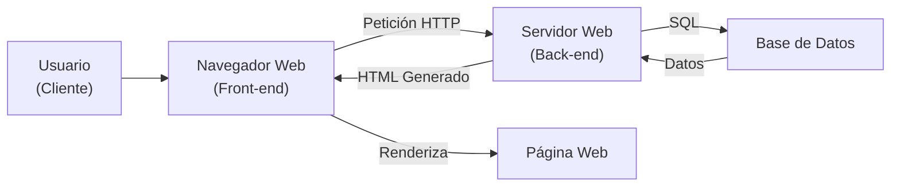
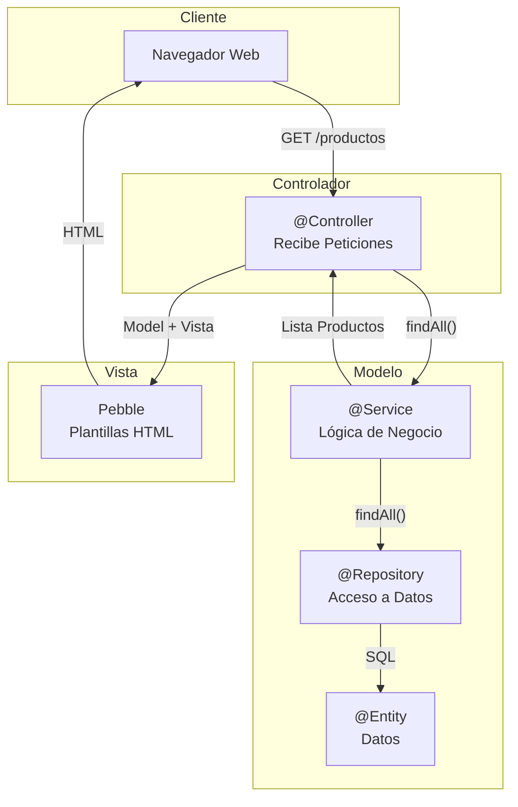
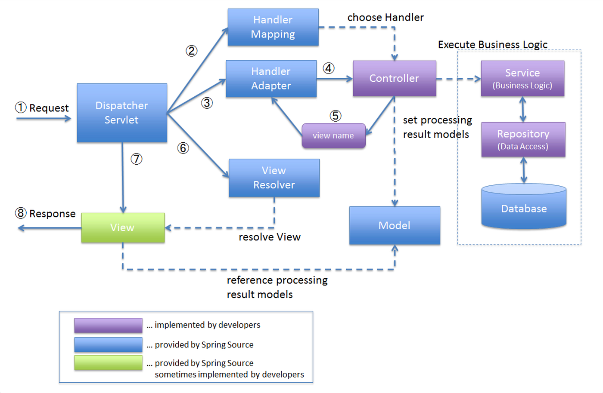
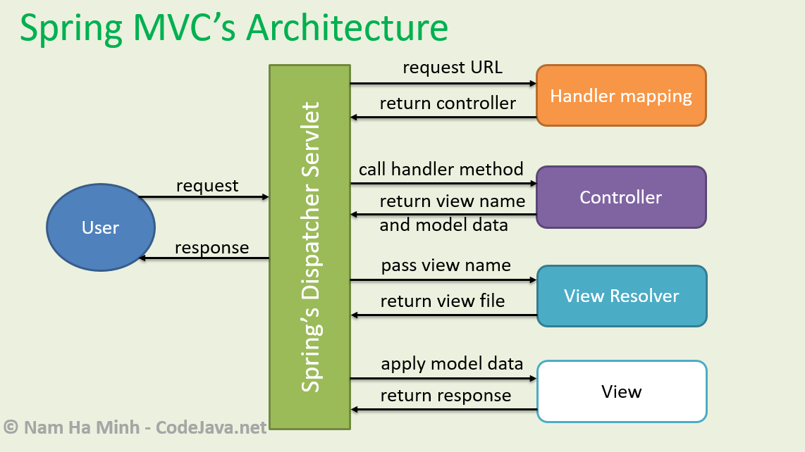
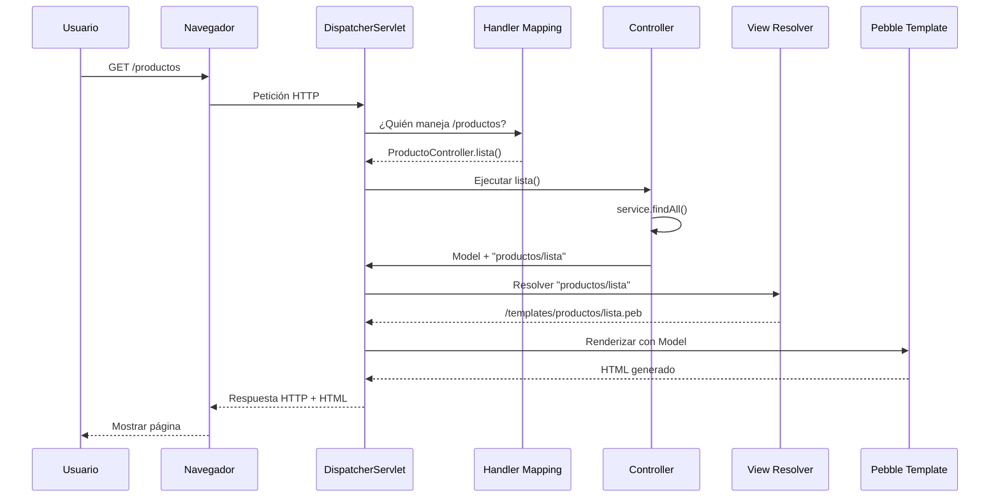

- [1. Fundamentos de la Generación Dinámica y Arquitectura MVC](#1-fundamentos-de-la-generación-dinámica-y-arquitectura-mvc)
    - [1.1 Introducción a la Generación Dinámica de Páginas Web](#11-introducción-a-la-generación-dinámica-de-páginas-web)
        - [1.1.1 El Modelo Cliente-Servidor y las Páginas Dinámicas](#111-el-modelo-cliente-servidor-y-las-páginas-dinámicas)
        - [1.1.2 La Pila Tecnológica](#112-la-pila-tecnológica)
        - [1.1.3 El Patrón de Diseño: Modelo-Vista-Controlador](#113-el-patrón-de-diseño-modelo-vista-controlador)
        - [1.1.4 Flujo Detallado de una Petición en Spring MVC](#114-flujo-detallado-de-una-petición-en-spring-mvc)
    - [1.2 Separación de Lógica y Presentación](#12-separación-de-lógica-y-presentación)
        - [1.2.1 Estructura de Proyecto](#121-estructura-de-proyecto)
        - [1.2.2 Principios de POO en la Lógica de Negocio](#122-principios-de-poo-en-la-lógica-de-negocio)

# 1. Fundamentos de la Generación Dinámica y Arquitectura MVC

## 1.1 Introducción a la Generación Dinámica de Páginas Web

Este módulo introduce los conceptos fundamentales de cómo el servidor genera contenido dinámico y la arquitectura profesional que utilizamos para organizarlo.

### 1.1.1 El Modelo Cliente-Servidor y las Páginas Dinámicas

En el desarrollo web estático (HTML, CSS, JavaScript básico), el modelo es simple: el cliente pide un archivo (`.html`) y el servidor se lo envía tal cual.

El **desarrollo en servidor** o "backend" introduce un proceso intermedio crucial. Cuando el servidor recibe una petición, no busca un archivo HTML, sino que **ejecuta un programa** para *crear* ese HTML en el momento.


Este proceso permite que la página sea **dinámica**: su contenido puede cambiar basándose en quién eres (un usuario logueado), qué hora es, qué hay en la base de datos, o cualquier otra lógica.

El flujo de una petición dinámica es el siguiente:

1. El **Cliente** solicita una página (ej. `http://localhost:8080/productos`).
2. El **Servidor Web** (en nuestro caso, un servidor Tomcat embebido en Spring Boot) recibe la petición.
3. El servidor identifica que esta URL no corresponde a un archivo, sino a una **acción de un programa**.
4. Se **ejecuta código Java** (nuestro Controller) que procesa la petición.
5. Este código Java consulta el **Modelo** (la lógica de negocio y la BBDD) para recopilar datos (ej. una lista de objetos Producto).
6. El servidor toma estos datos y los "inyecta" en una **Plantilla** (nuestro motor de plantillas **Pebble**).
7. El motor de plantillas "fusiona" la lógica de la plantilla (bucles, condicionales) con los datos, generando como resultado un **documento HTML final**.
8. El servidor envía este HTML recién generado de vuelta al cliente.
9. El navegador recibe el HTML y lo renderiza, sin tener idea de todo el proceso de Java que ocurrió en el servidor.

**Diferencias Clave: Ejecución en Cliente vs. Servidor**

- **Ejecución en Cliente:** Es el código (principalmente JavaScript) que se ejecuta **en el navegador del usuario**.
  - **Qué hace:** Manipula el DOM, realiza peticiones AJAX, valida formularios de forma instantánea.
  - **Limitaciones:** No puede acceder a la base de datos de forma segura, no puede ocultar "secretos" (como claves de API) y el usuario puede verlo y manipularlo.
- **Ejecución en Servidor:** Es el código (principalmente Java) que se ejecuta **en la máquina del servidor**.
  - **Qué hace:** Accede a la BBDD, ejecuta lógica de negocio compleja (calcular un precio, procesar un pago), comprueba la seguridad (autenticación y autorización).
  - **Ventaja:** Es seguro. El cliente **nunca** ve el código Java, solo el resultado HTML que este produce.

📝 **Nota del Profesor**: La diferencia fundamental entre cliente y servidor es **dónde se ejecuta el código**. El cliente (navegador) ejecuta JavaScript, el servidor ejecuta Java. Esta separación es crucial para la seguridad y el rendimiento.

💡 **Tip del Examinador**: En el examen, distingue claramente:
- **Front-end**: HTML, CSS, JavaScript → Se ejecuta en el navegador
- **Back-end**: PHP, Java, Python, Node.js → Se ejecuta en el servidor

⚠️ **Advertencia**: Las validaciones en el cliente son para mejorar la experiencia de usuario (UX), **NO** para seguridad. Siempre valida también en el servidor.

### 🧠 Analogía: El Restaurante

Imagina el desarrollo web como un restaurante:
- **Tú (Cliente)**: Eres el usuario. Miras el menú (Interfaz/Front-end) y pides un plato.
- **Camarero (Navegador/Red)**: Toma tu nota y la lleva a la cocina. No cocina, solo transporta mensajes.
- **Cocina (Servidor/Back-end)**: Recibe la orden. El chef comprueba si hay ingredientes en la despensa (Base de Datos), cocina el plato y lo entrega al camarero.
- **Plato (Web)**: Lo que recibes listo para consumir. No ves cómo se cocinó, solo ves el resultado.



### 1.1.2 La Pila Tecnológica

Para construir aplicaciones web modernas en Java, no usamos un solo lenguaje, sino una "pila" de tecnologías que trabajan juntas. Nuestra pila de referencia es:

- **Lenguaje:** **Java** (versión 17+ o 21+). El lenguaje de programación principal donde escribimos la lógica.
- **Framework Principal:** **Spring Boot**. Es el "pegamento" que une todo. Facilita la configuración, la seguridad, el acceso a datos y la creación de un servidor web listo para usar.
- **Framework Web:** **Spring MVC**. Es el componente de Spring que se encarga de gestionar las peticiones web y aplicar la arquitectura MVC.
- **Motor de Plantillas:** **Pebble**. Es la tecnología que nos permite "incrustar" código (bucles, condicionales) en nuestras plantillas HTML para generar el contenido dinámico. Es una alternativa moderna a otras como Thymeleaf o JSP.
- **Acceso a Datos:** **Spring Data JPA**. Es la herramienta que traduce nuestro código Java a código SQL de base de datos, y viceversa.
- **Base de Datos:** H2 o PostgreSQL/MySQL.
- **Gestor de Dependencias y Construcción:** **Gradle** (o Maven). Herramienta para gestionar las librerías del proyecto y empaquetarlo.

📝 **Nota del Profesor**: La "pila tecnológica" o **stack** es como layers de una pizza. Cada capa tiene su función específica y todas trabajan juntas. No necesitas ser experto en todas, pero sí entender cómo encajan.

💡 **Tip del Examinador**: Memoriza las tecnologías principales y sus funciones:
- Spring Boot → Configuración automática
- Spring MVC → Peticiones web
- Pebble → Plantillas HTML
- Spring Data JPA → Base de datos

### 1.1.3 El Patrón de Diseño: Modelo-Vista-Controlador

Este es el concepto **fundamental** de la arquitectura de aplicaciones web en servidor. Para evitar que nuestro código sea un caos inmanejable (conocido como "código espagueti"), separamos la aplicación en tres responsabilidades claras.

**Ventajas de la Separación:**

- **Mantenibilidad:** Si queremos cambiar el diseño (HTML/CSS), solo tocamos la **Vista**, sin miedo a romper la lógica de negocio.
- **Reusabilidad:** Podemos reutilizar el mismo **Modelo** (lógica de negocio) para una aplicación web (con Vistas HTML) y una API REST, solo cambiando el **Controlador**.
- **Testeo:** Es mucho más fácil realizar pruebas unitarias del **Modelo** y el **Controlador** de forma aislada, sin necesidad de levantar un navegador.

**Los Componentes del Patrón MVC:**

- **Modelo:**
  - **Qué es:** El "cerebro" de la aplicación.
  - **Qué contiene:**
    1. Los **datos** (clases de entidad, ej. `Producto.java`).
    2. La **lógica de negocio** (Servicios, ej. `ProductoService.java`).
    3. El acceso a la **base de datos** (Repositorios, ej. `ProductoRepository.java`).
  - **Regla:** No sabe *nada* sobre HTML o peticiones HTTP. Es Java puro.
- **Vista:**
  - **Qué es:** La "cara" de la aplicación.
  - **Qué contiene:** Las plantillas de presentación (en nuestro caso, los archivos `.peb`).
  - **Regla:** Es "tonta". No debe contener lógica de negocio. Solo debe mostrar los datos que le llegan, usar bucles y condicionales simples para presentarlos.
- **Controlador:**
  - **Qué es:** El "director de tráfico" o intermediario.
  - **Qué contiene:** Clases Java (`@Controller`) que gestionan las peticiones HTTP.
  - **Regla:** Es "delgado". Su único trabajo es:
    1. Recibir la petición HTTP (ej. `GET /productos`).
    2. Llamar al **Modelo** (al Service) para pedirle los datos (ej. `productoService.findAll()`).
    3. Elegir una **Vista** (ej. `"productos/lista"`).
    4. Pasar los datos del Modelo a la Vista.
  - **Importante:** El Controlador *no* debe consultar la BBDD directamente (eso lo hace el Modelo) y *no* debe generar HTML (eso lo hace la Vista).

📝 **Nota del Profesor**: El patrón MVC es como una obra de teatro:
- **Modelo** = Guión de la obra (la historia, los personajes)
- **Vista** = El escenario y los trajes (lo que ve el público)
- **Controlador** = El director que coordina actores y escenario

⚠️ **Advertencia**: Un error común es poner toda la lógica en el Controlador. ¡No lo hagáis! El Controller debe ser "delgado" (thin). La lógica de negocio va en los Servicios.

### 🧠 Analogía: La Fábrica

Imagina una fábrica de muebles:
- **Modelo**: Los planos del mueble y la máquina que lo construye. No sabe nada de cómo se ve la tienda.
- **Vista**: El escaparate de la tienda. Muestra el mueble终结好的, pero no lo construye.
- **Controlador**: El dependiente que recibe tu pedido, va a la fábrica a por el mueble y lo coloca en el escaparate.



### 1.1.4 Flujo Detallado de una Petición en Spring MVC

Para entender cómo funciona Spring MVC, veamos el flujo completo de una petición:

```
1. Petición HTTP  →  2. DispatcherServlet  →  3. Handler Mapping  
       ↑                                               ↓  
(HTML al Navegador)                                4. Controller (Nuestro código)  
       ↑                                               ↓  
   7. View   ←  6. View Resolver  ←  5. Model & View Name
```



1. **Petición HTTP:** El usuario escribe `http://localhost:8080/productos` en su navegador.
2. **DispatcherServlet:** Es el "controlador frontal" de Spring. Es un único Servlet que recibe **todas** las peticiones que llegan a la aplicación.
3. **Handler Mapping:** El DispatcherServlet pregunta al HandlerMapping (Mapeador de Manejadores): "¿Qué método de qué clase Java debe gestionar la URL `/productos`?". El HandlerMapping lo sabe gracias a nuestras anotaciones (ej. `@GetMapping("/productos")`).
4. **Controller:** El DispatcherServlet delega la petición a nuestro método en el `ProductoController`.
5. **Model & View Name:** Nuestro método del controlador hace su trabajo (llama al Service, obtiene la lista de productos) y devuelve dos cosas:
   - El **Modelo:** Un objeto `Model` que contiene los datos (ej. `model.addAttribute("productos", lista)`).
   - El **Nombre de la Vista:** Un `String` que es el nombre lógico de la plantilla (ej. `return "productos/lista"`).
6. **View Resolver:** El DispatcherServlet toma el nombre `"productos/lista"` y se lo da al ViewResolver (Resolutor de Vistas). El ViewResolver de Pebble traduce ese nombre a una ruta de archivo físico (ej. `src/main/resources/templates/productos/lista.peb`).
7. **View:** La plantilla Pebble se renderiza, fusionando la plantilla `.peb` con los datos del Model. El resultado es un String largo que contiene el HTML final.
8. El DispatcherServlet toma este HTML y lo envía como respuesta HTTP de vuelta al navegador.



📝 **Nota del Profesor**: El `DispatcherServlet` es como el recepcionista de un hotel. Recibe todas las llamadas (peticiones HTTP), las clasifica y las dirige al departamento adecuado (Controller).

💡 **Tip del Examinador**: Conoce los 7 pasos del flujo MVC. Es un clásico en los exámenes:
1. Petición HTTP
2. DispatcherServlet
3. Handler Mapping
4. Controller
5. Model & View Name
6. View Resolver
7. View (renderiza HTML)



## 1.2 Separación de Lógica y Presentación

### 1.2.1 Estructura de Proyecto

El patrón MVC se refleja directamente en cómo organizamos nuestras carpetas en un proyecto de Spring Boot:

```
src/main/  
├── java/com/ejemplo/app/  
│   ├── controllers/  <--  CONTROLADOR (Spring MVC)  
│   │   ├── ProductoController.java  
│   │   └── AuthController.java  
│   ├── models/         <--  MODELO (Entidades JPA)  
│   │   └── Producto.java  
│   ├── services/       <--  MODELO (Lógica de Negocio)  
│   │   ├── ProductoService.java  
│   │   └── EmailService.java  
│   ├── repositories/   <--  MODELO (Acceso a BBDD)  
│   │   └── ProductoRepository.java  
│   ├── config/         <-- Configuración (Seguridad, Pebble, Beans)  
│   │   └── SeguridadConfig.java  
│   └── security/       <-- Configuración específica de seguridad  
│  
└── resources/  
    ├── templates/      <--  VISTA (Plantillas Pebble)  
    │   ├── layouts/  
    │   │   └── base.peb  
    │   ├── fragments/  
    │   │   └── navbar.peb  
    │   ├── productos/  
    │   │   ├── lista.peb  
    │   │   └── detalle.peb  
    │   └── index.peb  
    ├── static/         <--  VISTA (Archivos estáticos)  
    │   ├── css/  
    │   ├── js/  
    │   └── images/  
    ├── application.properties <-- Configuración de la aplicación  
    └── messages_es.properties <-- Ficheros de Internacionalización
```

- **Lógica de Negocio:** Toda la carpeta `java/`. El navegador nunca tendrá acceso a esto.
- **Presentación:** Las carpetas `resources/templates/` y `resources/static/`.

📝 **Nota del Profesor**: La estructura de carpetas no es arbitraria. Spring Boot sigue convenciones ("convention over configuration"). Si pones los Controllers en otro sitio, Spring no los encontrará.

### 1.2.2 Principios de POO en la Lógica de Negocio

Dentro de la capa de **Modelo**, aplicamos principios de Programación Orientada a Objetos y Diseño (como **SOLID**) para separar aún más las responsabilidades:

1. **Entidades (`@Entity`):**
   - Son clases "POJO" (Plain Old Java Object) que representan una tabla en la BBDD.
   - Contienen atributos y sus getters/setters.
   - Ejemplo: `Producto.java`, `Usuario.java`.
2. **Repositorios (`@Repository`):**
   - Son interfaces que extienden de `JpaRepository`.
   - Su **única** responsabilidad es hablar con la BBDD (CRUD: Create, Read, Update, Delete).
   - Spring Data JPA nos da mágicamente los métodos (`findAll()`, `findById()`, `save()`) sin que tengamos que implementarlos.
   - Ejemplo: `ProductoRepository.java`.
3. **Servicios (`@Service`):**
   - El "corazón" de la lógica de negocio.
   - Orquesta uno o más repositorios.
   - Aplica las reglas de negocio.
   - Es la capa que llama el Controlador.
   - Ejemplo: `ProductoService.java`.

**Flujo de la Lógica de Negocio (Patrón Service-Repository):**

**Ejemplo de Separación Correcta:**

**❌ Mal (Lógica en el Controller):**

```java
@Controller
public class ProductoController {
    @Autowired
    private ProductoRepository repositorio; // Mal, el Controller no debe conocer al Repository

    @GetMapping("/productos")
    public String lista(Model model) {
        // Mal, la lógica de negocio (buscar en BBDD) está en el Controller
        List<Producto> productos = repositorio.findAll();
        model.addAttribute("productos", productos);
        return "productos/lista";
    }
}
```

**✅ Bien:**

```java
// --- CAPA REPOSITORY ---
public interface ProductoRepository extends JpaRepository<Producto, Long> {
    // Métodos de BBDD
}

// --- CAPA SERVICE ---
@Service
public class ProductoService {
    @Autowired
    private ProductoRepository repositorio;

    @Cacheable("productos") // Mecanismo de cache
    public List<Producto> findAll() {
        // Aquí podría haber más lógica (logs, etc.)
        return repositorio.findAll();
    }
}

// --- CAPA CONTROLLER ---
@Controller
public class ProductoController {
    @Autowired
    private ProductoService servicio; // Bien, el Controller solo conoce al Service

    @GetMapping("/productos")
    public String lista(Model model) {
        // Bien, el controller solo pide los datos.
        // La lógica de cómo se obtienen (BBDD, cache) está oculta en el Servicio.
        model.addAttribute("productos", servicio.findAll());
        return "productos/lista";
    }
}
```

📝 **Nota del Profesor**: Esta separación en tres capas (Controller → Service → Repository) se llama **Arquitectura en Capas** (Layered Architecture). Es el estándar en aplicaciones empresariales Java.

💡 **Tip del Examinador**: En los exámenes prácticos, siempre separa las responsabilidades:
- Controller = Recibe petición, llama Service, devuelve vista
- Service = Lógica de negocio
- Repository = Acceso a datos

⚠️ **Advertencia**: Si en el examen ponéis lógica de base de datos en el Controller, restará puntos. ¡Siempre pasad por el Service!

### 🧠 Analogía: La Biblioteca

Imaginad una biblioteca:
- **Controller**: El bibliotecario. Recibe tu petición ("Quiero libros de ciencia ficción").
- **Service**: El catálogo. Busca dónde están esos libros, cómo organizarlos.
- **Repository**: Los estantes. Acceso físico a los libros.
- **Entity**: El libro en sí.

Tú no vas directamente a los estantes (Repository) ni buscas tú mismo (Service). Le pides al bibliotecario (Controller) que lo haga por ti.
