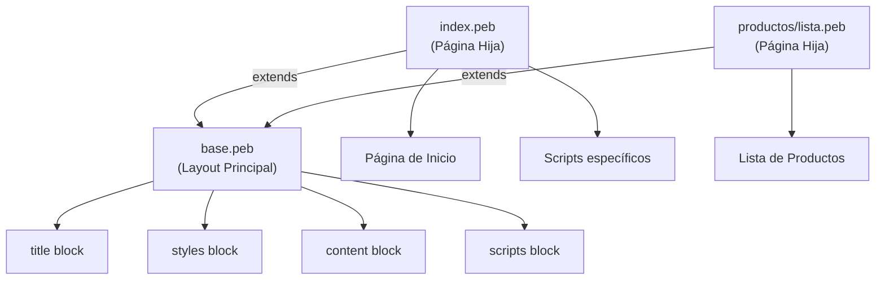

- [2. El Motor de Plantillas Pebble](#2-el-motor-de-plantillas-pebble)
    - [2.1 Sintaxis Básica de Pebble](#21-sintaxis-básica-de-pebble)
    - [2.2 Variables, Operadores y Tipos](#22-variables-operadores-y-tipos)
        - [2.2.1 Paso de Variables del Controlador a la Vista](#221-paso-de-variables-del-controlador-a-la-vista)
        - [2.2.2 Operadores en Pebble](#222-operadores-en-pebble)
        - [2.2.3 Asignación de Variables (Directiva set)](#223-asignación-de-variables-directiva-set)
    - [2.3 Estructuras de Control](#23-estructuras-de-control)
        - [2.3.1 Condicionales (if, elseif, else)](#231-condicionales-if-elseif-else)
        - [2.3.2 Bucles](#232-bucles)
    - [2.4 Reutilización de Código en Vistas](#24-reutilización-de-código-en-vistas)
        - [2.4.1 Herencia de Plantillas (extends y block)](#241-herencia-de-plantillas-extends-y-block)
        - [2.4.2 Inclusión de Fragmentos](#242-inclusión-de-fragmentos)
        - [2.4.3 Macros (Funciones de Pebble)](#243-macros-funciones-de-pebble)
    - [2.5 Filtros y Funciones](#25-filtros-y-funciones)
        - [2.5.1 Filtros Incorporados](#251-filtros-incorporados)
        - [2.5.2 Filtros Personalizados del Proyecto](#252-filtros-personalizados-del-proyecto)
        - [2.5.3 Filtros que NO Existen y Soluciones](#253-filtros-que-no-existen-y-soluciones)

# 2. El Motor de Plantillas Pebble

Aquí cubrimos cómo "incrustar código" en nuestros lenguajes de marcas. En nuestra pila, esto lo hace **Pebble**. Pebble es un motor de plantillas inspirado en Twig y Jinja, conocido por su sintaxis limpia y su alto rendimiento. Otros motores populares incluyen Thymeleaf y FreeMarker, pero Pebble es ligero y fácil de usar.

## 2.1 Sintaxis Básica de Pebble

Pebble (y la mayoría de motores de plantillas) tiene tres delimitadores principales:

1. `{{ ... }}` - Salida de Expresiones
   - Se usa para **imprimir** o **mostrar** el contenido de una variable.
   - Realiza **auto-escape** por defecto. Esto es una medida de seguridad crucial que previene ataques XSS (Cross-Site Scripting).
   - Ejemplo: `<h2>{{ producto.nombre }}</h2>` se convertirá en `<h2>iPhone 15 Pro Max</h2>`.
   - Ejemplo de Seguridad: `{{ "<script>alert('XSS')</script>" }}` se renderizará en el HTML como `<script>alert("XSS")</script>`, lo cual es texto inofensivo y no un script ejecutable.

2. `` - Etiquetas de Control
   - Se usa para **ejecutar lógica** de presentación. No imprime nada por sí mismo.
   - Se usa para condicionales, bucles, herencia de plantillas (extends, block), e inclusión de fragmentos.
   - Ejemplo: ``

3. `{# ... #}` - Comentarios
   - Estos comentarios son **solo para el desarrollador**. Se eliminan completamente durante la compilación de la plantilla y **no** se envían al navegador. Son perfectos para documentar la plantilla.
   - Ejemplo: `{# Esto es un comentario de Pebble que el usuario nunca verá #}`.
   - No confundir con comentarios HTML (`<!-- ... -->`), que sí se envían al navegador.

📝 **Nota del Profesor**: Los tres delimitadores son como señales de tráfico:
- `{{ }}` = "Muestra esto" (cartel indicador)
- `` = "Haz esto" (semáforo o paso)
- `{# #}` = "Nota para el constructor" (no se ve en la carretera)

💡 **Tip del Examinador**: El auto-escape de Pebble (`{{ }}`) es tu защита contra XSS. Nunca uses `| raw` a menos que estés absolutamente seguro del contenido.

⚠️ **Advertencia**: Los comentarios `{# ... #}` NO se envían al navegador, pero los comentarios HTML `<!-- ... -->` SÍ. Para notas de desarrollo, usa siempre `{# #}`.

## 2.2 Variables, Operadores y Tipos

### 2.2.1 Paso de Variables del Controlador a la Vista

Las variables no existen mágicamente en Pebble. Deben ser **pasadas explícitamente** desde el Controller usando un objeto `Model`.

**Controlador:**

```java
@GetMapping("/producto/{id}")  
public String detalle(@PathVariable Long id, Model model) {  
    // 1. Obtenemos datos (Lógica de Negocio)  
    Producto producto = productoServicio.findById(id);  
    List<Producto> relacionados = productoServicio.findByCategoria(producto.getCategoria());  
    String tituloPagina = "Detalle de Producto";  
    boolean esAdmin = /* ... (comprobar rol) ... */;

    // 2. Añadimos datos al "Model" (un mapa clave-valor)  
    model.addAttribute("producto", producto); // Clave "producto"   
    model.addAttribute("relacionados", relacionados); // Clave "relacionados"   
    model.addAttribute("titulo", tituloPagina); // Clave "titulo"   
    model.addAttribute("esAdmin", esAdmin); // Clave "esAdmin"   
      
    // 3. Devolvemos el nombre de la plantilla  
    return "productos/detalle"; // Carga /templates/productos/detalle.peb  
}
```

**Vista (Pebble/Twig):**

```twig
{# Ámbito de Variables: #}
{# Las variables "producto", "relacionados", "titulo" y "esAdmin" existen #}
{# globalmente en esta plantilla gracias al Model del controlador. #}

<h1>{{ titulo }}</h1>

<h2>{{ producto.nombre }}</h2>
<p>Descripción: {{ producto.descripcion }}</p>
<p>Precio: {{ producto.precio }}</p>

{# Acceso a propiedades de objetos anidados #}
<p>Vendedor: {{ producto.propietario.nombre }}</p>


    <a href="/producto/editar/{{ producto.id }}">Editar </a>


<h3>Productos Relacionados:</h3>
<ul>
    
        <li>{{ rel.nombre }}</li>
    
</ul>
```

📝 **Nota del Profesor**: El Model es como una mochila que el Controller le pasa a la Vista. Solo contiene lo que el Controller decide meter. Si olvidas añadir algo, no existirá en la vista.

### 2.2.2 Operadores en Pebble

Pebble soporta la mayoría de operadores que esperarías:

- **Aritméticos:** +, -, *, /, %
  - `{{ (producto.precio * 0.21) | numberformat('0.00') }}€`
- **Comparación:** ==, !=, <, >, <=, >=
  - ``
- **Lógicos:** and, or, not
  - ``
- **Ternario:** `{{ condición ? 'valor_si_true' : 'valor_si_false' }}`
  - `{{ producto.stock > 0 ? 'Disponible' : 'Agotado' }}`
- **Concatenación de Strings:** `~`
  - `{{ 'Hola, ' ~ usuario.nombre ~ '!' }}`
- **Contención:** in, not in
  - ``

💡 **Tip del Examinador**: El operador `~` es muy útil para concatenar strings en Pebble. En JavaScript sería `+`, en Python `+`, en Pebble es `~`.

### 2.2.3 Asignación de Variables (Directiva set)

Podemos crear variables temporales directamente en Pebble usando la directiva set. Esto es útil para cálculos o para hacer el código más legible.

```twig
{# Ejemplo: Cálculo de IVA y Total #}
{# Calculamos el IVA y lo guardamos en una variable 'iva' #}  
  
<p>IVA: {{ iva | formatPrice }}</p>
```

📝 **Nota del Profesor**: La directiva `set` es como usar una variable temporal en matemáticas. Haces el cálculo una vez y le das un nombre para reutilizarlo.

## 2.3 Estructuras de Control

Aquí es donde Pebble se vuelve potente, permitiéndonos generar HTML dinámico.

### 2.3.1 Condicionales (if, elseif, else)

El `if` se usa para mostrar/ocultar bloques de HTML dinámicamente. Es la herramienta principal para la "modificación dinámica de estructura".

```twig
{# Ejemplo 1: Condicional simple #}  
  
    <span class="badge bg-success">Verificado</span>  

```

```twig
{# Ejemplo 2: if / else #}  
  
    <a href="/comprar/{{ producto.id }}" class="btn btn-success">Comprar</a>  
  
    <span class="btn btn-secondary disabled">Agotado</span>  

```

```twig
{# Ejemplo 3: if / elseif / else #}  
  
    <span class="badge bg-danger">Administrador</span>  
  
    <span class="badge bg-warning">Moderador</span>  
  
    <span class="badge bg-info">Usuario</span>  

```

```twig
{# Ejemplo 4: Verificación de nulos (MUY IMPORTANTE) #}  
{# En Pebble, un objeto nulo puede dar error. Usa 'is not null' #}  
  
    <span class="badge bg-success">Vendido</span>  
  
    <span class="badge bg-warning">Disponible</span>  

```

```twig
{# Ejemplo 5: Verificación de cadenas vacías #}  
  
    <h2>Bienvenido, {{ usuario.nombre }}!</h2>  
  
    <h2>Bienvenido, Invitado!</h2>  

```

```twig
{# Ejemplo 6: Operador ternario #}  
<p>Estado: {{ producto.stock > 0 ? 'En Stock' : 'Agotado' }}</p>
```

📝 **Nota del Profesor**: Los condicionales en Pebble son como preguntas de sí/no. Solo muestran el contenido si la respuesta es afirmativa. Son fundamentales para personalizar la vista según los datos.

⚠️ **Advertencia**: Siempre verificad si un objeto puede ser null antes de acceder a sus propiedades. `producto.compra` puede ser null y causar un error en la plantilla.

### 2.3.2 Bucles

El bucle `for` es la herramienta principal para iterar sobre colecciones pasadas desde el controlador.

**Controlador:**

```java
@GetMapping("/productos")  
public String listar(Model model) {  
    List<Producto> listaDeProductos = productoServicio.findAll();  
    model.addAttribute("productos", listaDeProductos); // Pasamos una List<Producto>  
    return "productos/lista";  
}
```

**Vista:**

```twig
{# Iteramos sobre la "matriz" de productos #}  
<div class="row">  
      
        <div class="col-md-4 mb-3">  
            <div class="card h-100">  
                  
                <div class="card-body">  
                    <h5 class="card-title">{{ producto.nombre }}</h5>  
                    <p class="card-text">{{ producto.descripcion | abbreviate }}</p>  
                    <p class="text-primary fs-4">  
                        <strong>{{ producto.precio | formatPrice }}</strong>  
                    </p>  
                    <a href="/producto/{{ producto.id }}" class="btn btn-primary">Ver Detalle</a>  
                </div>  
            </div>  
        </div>  
      
</div>
```

**Manejo de Bucles Vacíos:**

El bucle for de Pebble incluye una directiva else que se ejecuta solo si la colección está vacía.

```twig
<div class="list-group">  
      
        <div class="list-group-item">  
            <strong>{{ comentario.usuario.nombre }}:</strong>  
            <p>{{ comentario.texto }}</p>  
        </div>  
      
        {# Esta sección se ejecuta si 'producto.comentarios' está vacío #}  
        <div class="list-group-item">  
            <p class="text-muted">No hay comentarios para este producto. ¡Sé el primero!</p>  
        </div>  
      
</div>
```

**Variables Especiales del Bucle:**

Dentro de un `for`, Pebble nos da una variable especial `loop`:

- `loop.index`: El índice actual (empezando en 1).
- `loop.index0`: El índice actual (empezando en 0).
- `loop.first`: Es true si es la primera iteración.
- `loop.last`: Es true si es la última iteración.
- `loop.length`: El número total de elementos en la colección.

```twig
<table>  
      
        {# Añade una clase 'table-active' solo a la primera fila #}  
        <tr class="{{ loop.first ? 'table-active' : '' }}">  
            <td>{{ loop.index }} / {{ loop.length }}</td>  
            <td>{{ usuario.nombre }}</td>  
        </tr>  
      
</table>
```

📝 **Nota del Profesor**: El bucle `for` es tu herramienta para mostrar listas. El bloque `` es muy importante para manejar el caso de "no hay datos". ¡No lo olvidéis!

💡 **Tip del Examinador**: Las variables `loop.first` y `loop.last` son muy útiles para añadir clases CSS condicionales (bordes, separadores, etc.) sin lógica compleja.

## 2.4 Reutilización de Código en Vistas

Esto es fundamental para aplicar el principio **DRY (Don't Repeat Yourself)**. No queremos copiar y pegar el navbar y el footer en cada uno de nuestros 30 archivos HTML. Pebble ofrece tres mecanismos para esto.

### 2.4.1 Herencia de Plantillas (extends y block)

Es el mecanismo más potente y recomendado.

1. **Definimos un "esqueleto" o "layout" base** con "agujeros".
2. **Las plantillas "hijas"** "extienden" ese esqueleto y se limitan a "rellenar los agujeros".

**templates/layouts/base.peb (El Esqueleto o Layout):**

```html
<!DOCTYPE html>  
<html lang="es">  
<head>  
    <meta charset="UTF-8">  
    <meta name="viewport" content="width=device-width, initial-scale=1.0">  
      
    {# Directiva 'block' define un "agujero" con contenido por defecto #}  
    <title>Mi Aplicación E-Commerce</title>  
      
    <link href="https://cdn.jsdelivr.net/npm/bootstrap@5.3.3/dist/css/bootstrap.min.css" rel="stylesheet">  
      
    {# Un bloque para CSS adicional #}  
      
</head>  
<body>  
    {# Incluimos el navbar #}  
      
      
    <main class="container mt-4">  
        {# El "agujero" principal para el contenido de la página #}  
          
            <p>Contenido por defecto si la plantilla hija no lo define.</p>  
          
    </main>  

    <footer class="mt-5 py-3 bg-light text-center">  
        <p>© {{ "now" | date("Y") }} Mi Aplicación</p>  
    </footer>  

    <script src="https://cdn.jsdelivr.net/npm/bootstrap@5.3.3/dist/js/bootstrap.bundle.min.js"></script>  

    {# Un bloque para JavaScript adicional #}  
      
</body>  
</html>
```

**templates/index.peb (La Página Hija):**

```twig
{# Directiva 'extends': Le dice a Pebble que use 'base.peb' como esqueleto #}  

```

```twig
{# Rellenamos el bloque 'title' #}
{# 'parent()' incluye el contenido del bloque padre ("Mi Aplicación E-Commerce") #}
Página de Inicio - {{ parent() }}
```

```twig
{# Rellenamos el bloque 'content' #}  
  
    <div class="p-5 mb-4 bg-light rounded-3">  
        <div class="container-fluid py-5">  
            <h1 class="display-5 fw-bold">¡Bienvenido!</h1>  
            <p class="col-md-8 fs-4">La mejor plataforma de compra-venta de segunda mano.</p>  
        </div>  
    </div>  
      
    <h2>Productos Destacados</h2>  
    {# ... Aquí iría el bucle 'for' de productos ... #}  

```

```twig
{# Rellenamos el bloque 'scripts' para añadir JS específico #}  
  
    <script>  
        console.log('Página de inicio cargada');  
    </script>  

```

📝 **Nota del Profesor**: La herencia de plantillas es como una plantilla de Word. Tienes un documento base con huecos (blocks) y cada página específica solo llena esos huecos. ¡Mucho más eficiente que copiar y pegar!

💡 **Tip del Examinador**: Usa `{{ parent() }}` cuando quieras mantener el contenido del padre y añadirle algo más, no cuando quieras reemplazarlo completamente.



### 2.4.2 Inclusión de Fragmentos

Se usa para insertar un trozo de plantilla dentro de otra. Es perfecto para componentes reutilizables (navbar, footer, un formulario de login, una tarjeta de producto).

**templates/fragments/navbar.peb:**

```twig
<nav class="navbar navbar-expand-lg navbar-dark bg-dark">  
    <div class="container-fluid">  
        <a class="navbar-brand" href="/">Mi E-Commerce</a>  
        <ul class="navbar-nav ms-auto">  
            {# ... toda la lógica de 'isAuthenticated' y 'isAdmin' ... #}  
            {# ... y el badge del 'cartItemCount' ... #}  
        </ul>  
    </div>  
</nav>
```

Esta plantilla se inserta en base.peb usando ``.

`include` también puede pasar variables:

```twig
{# Pasamos un mensaje de alerta y un tipo al fragmento 'alert' #}  

```

📝 **Nota del Profesor**: El `include` es como copiar y pegar, pero mucho más limpio. Si cambias el navbar, cambia en todas las páginas automáticamente.

### 2.4.3 Macros (Funciones de Pebble)

Las macros son "funciones" reutilizables que devuelven HTML, definidas en Pebble. Son perfectas para elementos de UI complejos que se repiten mucho, como los campos de un formulario.

**templates/macros/forms.peb (definición de la macro):**

```twig
{# Creación de una "función" en Pebble #}
{# Define un campo de formulario de Bootstrap #}
  
<div class="mb-3">  
    <label for="{{ name }}" class="form-label">{{ label }}</label>  
    <input type="{{ type }}"   
           class="form-control"   
           id="{{ name }}"   
           name="{{ name }}"   
           value="{{ value }}"  
           required>  
    {# Aquí podríamos añadir lógica para mostrar errores de validación #}  
</div>  

```

```twig
  
<div class="mb-3">  
    <label for="{{ name }}" class="form-label">{{ label }}</label>  
    <textarea class="form-control"   
              id="{{ name }}"   
              name="{{ name }}"   
              rows="{{ rows }}">{{ value }}</textarea>  
</div>  

```

**Uso en una plantilla de formulario:**

```twig
  
{# 1. Importamos el archivo que contiene las macros #}  

```

```twig
  
    <h1>Crear/Editar Producto</h1>  
      
    <form method="POST" action="/productos/guardar">  
        {# 2. Utilizamos las "funciones" importadas #}  
        {{ forms.input('nombre', 'Nombre del Producto', producto.nombre, required=true) }}  
          
        {{ forms.input('precio', 'Precio', producto.precio, type='number') }}  
          
        {{ forms.textarea('descripcion', 'Descripción', producto.descripcion, rows=5) }}  
          
        <button type="submit" class="btn btn-primary">Guardar</button>  
    </form>  

```

📝 **Nota del Profesor**: Las macros son como componentes en React o Vue. Defines un "componente" una vez y lo usas en muchos sitios con diferentes datos. ¡Adiós al código duplicado!

## 2.5 Filtros y Funciones

Los **Filtros** (usando `|`) son funciones que transforman el valor de una variable antes de imprimirla.

### 2.5.1 Filtros Incorporados

Pebble incluye muchos filtros útiles:

- **Texto:**
  - `{{ 'hola' | upper }}` → HOLA
  - `{{ 'HOLA' | lower }}` → hola
  - `{{ 'hola mundo' | capitalize }}` → Hola mundo
  - `{{ ' hola ' | trim }}` → hola
  - `{{ producto.descripcion | slice(0, 100) }}` → Primeros 100 caracteres
  - `{{ producto.descripcion | abbreviate }}` → Trunca a 100 caracteres y añade "..." si es necesario
- **Fechas:**
  - `{{ "now" | date("dd/MM/yyyy HH:mm") }}` → 14/11/2025 12:42
  - `{{ fechaDeCompra | date('full') }}` → viernes, 14 de noviembre de 2025
- **Colecciones:**
  - `{{ productos | length }}` → Devuelve el número de ítems
  - `{{ productos | first }}` → Devuelve el primer producto de la lista
  - `{{ tags | join(', ') }}` → tag1, tag2, tag3
- **Valores por Defecto:**
  - `{{ producto.imagen | default('https://placehold.co/600x400?text=Sin+Imagen') }}`
  - Se usa si `producto.imagen` es null, un String vacío o una colección vacía
- **Seguridad:**
  - `{{ variable }}` → Auto-escape, seguro por defecto
  - `{{ htmlContenido | raw }}` → Desactiva el auto-escape (¡PELIGROSO!)

📝 **Nota del Profesor**: Los filtros son como métodos de transformación. Pones el dato a la izquierda, el filtro a la derecha con `|`, y sale transformado. Como una cadena de montaje.

💡 **Tip del Examinador**: El filtro `default` es tu mejor amigo contra NullPointerExceptions. úsalo siempre que un dato pueda ser null.

### 2.5.2 Filtros Personalizados del Proyecto

A veces, necesitamos un formato muy específico. Pebble nos permite crear nuestros propios filtros en Java.

**Configuración (Java):**

```java
@Configuration  
public class PebbleConfig {  
    @Bean  
    public io.pebbletemplates.pebble.extension.Extension customPebbleExtension() {  
        return new AbstractExtension() {  
            @Override  
            public Map<String, Filter> getFilters() {  
                Map<String, Filter> filters = new HashMap<>();  
                // Registramos nuestros filtros personalizados  
                filters.put("formatPrice", new FormatPriceFilter());  
                filters.put("formatDate", new FormatDateFilter());  
                return filters;  
            }  
        };  
    }  
      
    // Implementación del filtro de precio  
    private static class FormatPriceFilter implements Filter {  
        @Override  
        public Object apply(Object input, Map<String, Object> args,   
                          io.pebbletemplates.pebble.template.PebbleTemplate self,   
                          io.pebbletemplates.pebble.template.EvaluationContext context,   
                          int lineNumber) throws io.pebbletemplates.pebble.error.PebbleException {  
            if (input == null) return "0,00 €";  
            try {  
                double price = ((Number) input).doubleValue();  
                // Lógica para formatear a "1.500,50 €"  
                DecimalFormatSymbols symbols = new DecimalFormatSymbols(new Locale("es", "ES"));  
                DecimalFormat df = new DecimalFormat("#,##0.00 €", symbols);  
                return df.format(price);  
            } catch (Exception e) {  
                return input.toString();  
            }  
        }  
          
        @Override  
        public List<String> getArgumentNames() {  
            return null;  
        }  
    }  
}
```

**Uso en Pebble:**

```twig
{# ❌ Sin filtro: 1599.5 #}  
<p>Precio: {{ producto.precio }}</p>
```

```twig
{# ✅ Con filtro personalizado: 1.599,50 € #}  
<p>Precio: {{ producto.precio | formatPrice }}</p>
```

### 2.5.3 Filtros que NO Existen y Soluciones

Es importante saber qué filtros **no** existen en Pebble y cómo solucionarlo:

- **❌ truncate / truncatewords:** No existe un filtro truncate inteligente.
  - **✅ Solución 1:** Usar `slice(0, 100)` (Corta bruscamente)
  - **✅ Solución 2:** Usar `abbreviate` (Añade "...")
  - **✅ Solución 3:** Preparar el dato en el Service antes de pasarlo a la vista
- **❌ pluralize:** No existe un filtro para plurales (ej. 1 producto, 2 productos)
  - **✅ Solución:** `{{ count }} producto{{ count == 1 ? '' : 's' }}`
- **❌ striptags:** No existe un filtro para quitar etiquetas HTML
  - **✅ Solución:** Si necesitas esto, debes hacerlo en el **Servicio** usando una librería como Jsoup, *antes* de enviar el dato a la vista

📝 **Nota del Profesor**: Pebble es opinionado. No tiene todos los filtros que puedas imaginar. Cuando un filtro no existe, la solución está en tu código Java (Service) o en usar un filtro existente de forma creativa.

⚠️ **Advertencia**: Nunca uses `| raw` con datos que vengan del usuario. Es la puerta de entrada a ataques XSS. Usa `| raw` solo con contenido que tú mismo hayas generado y controles al 100%.
