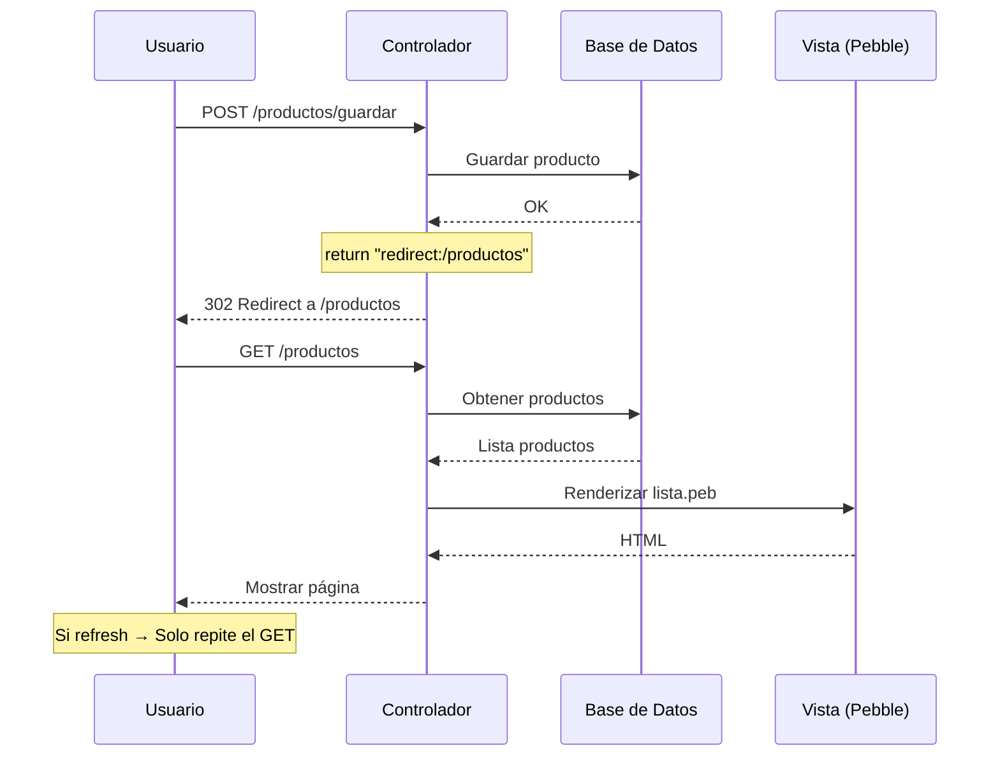

- [3. Controlador, Modelos y el Manejo de Formularios](#3-controlador-modelos-y-el-manejo-de-formularios)
    - [3.1 El Controlador (@Controller) y el Modelo](#31-el-controlador-controller-y-el-modelo)
        - [3.1.1 Model vs ModelAndView](#311-model-vs-modelandview)
        - [3.1.2 Parámetros del Método del Controlador](#312-parámetros-del-método-del-controlador)
    - [3.2 Manejo de Formularios](#32-manejo-de-formularios)
        - [Paso 1: Mostrar el Formulario (Petición GET)](#paso-1-mostrar-el-formulario-petición-get)
        - [Paso 2: Procesar los Datos (Petición POST)](#paso-2-procesar-los-datos-petición-post)
        - [3.2.3 Patrón Post-Redirect-Get](#323-patrón-post-redirect-get)
    - [3.3 Validación de Datos en el Servidor](#33-validación-de-datos-en-el-servidor)
        - [Paso 1: Añadir Reglas de Validación a la Entidad](#paso-1-añadir-reglas-de-validación-a-la-entidad)
        - [Paso 2: Activar la Validación en el Controlador](#paso-2-activar-la-validación-en-el-controlador)
        - [Paso 3: Mostrar Errores en la Vista](#paso-3-mostrar-errores-en-la-vista)

# 3. Controlador, Modelos y el Manejo de Formularios

Aquí conectamos las Vistas con la Lógica de Negocio a través del Controlador (Spring MVC).

## 3.1 El Controlador (@Controller) y el Modelo

Un Controller es una clase Java anotada con `@Controller`. Sus métodos, anotados con `@GetMapping`, `@PostMapping`, etc., son los "manejadores" que se ejecutan cuando un usuario accede a una URL específica.

```java
@Controller  
@RequestMapping("/productos") // Prefijo para todas las URLs de este controller  
public class ProductoController {

    @Autowired // Inyección de dependencias (Spring nos da el Service)  
    private ProductoServicio productoServicio;  
      
    // Este método se activa con GET /productos y es responsable de generar el aspecto visual  
    @GetMapping  
    public String listar(Model model) {  
        // 1. Pedir datos al Servicio  
        List<Producto> productos = productoServicio.findAll();  
          
        // 2. Poner datos en el Modelo  
        model.addAttribute("productos", productos);  
          
        // 3. Devolver nombre de la Vista  
        return "productos/lista"; // Carga /templates/productos/lista.peb  
    }

    // Este método maneja URLs dinámicas como /productos/1, /productos/2, etc.  
    @GetMapping("/{id}")  
    public String detalle(  
        @PathVariable Long id, // Recoge el 'id' de la URL  
        Model model  
    ) {  
        Producto producto = productoServicio.findById(id);  
        model.addAttribute("producto", producto);  
        return "productos/detalle";  
    }  
}
```

📝 **Nota del Profesor**: El Controller es como un camarero en un restaurante. Recibe tu pedido (petición HTTP), lo lleva a la cocina (Service), y te trae la comida (Vista). ¡No cocina él mismo!

### 3.1.1 Model vs ModelAndView

Hay dos formas de pasar datos del Controlador a la Vista:

**1. Model (Enfoque Moderno y Recomendado):**

- **Cómo:** Recibes un `Model` como parámetro del método. Añades atributos (`model.addAttribute(...)`) y devuelves un String con el nombre de la vista.
- **Ventaja:** Más limpio, más flexible (puedes tener if/else y devolver distintos String de vistas) y mucho más fácil de testear.

```java
@GetMapping("/detalle/{id}")  
public String detalle(@PathVariable Long id, Model model) {  
    Producto producto = productoServicio.findById(id);

    if (producto == null) {  
        model.addAttribute("error", "Producto no encontrado");  
        return "error/404"; // Fácil retornar vistas diferentes  
    }

    model.addAttribute("producto", producto);  
    return "productos/detalle"; // Vista principal  
}
```

**2. ModelAndView (Enfoque Clásico):**

- **Cómo:** Creas un objeto `ModelAndView`. Estableces el nombre de la vista (`mav.setViewName(...)`) y añades objetos (`mav.addObject(...)`). Devuelves el objeto MAV.
- **Ventaja:** Encapsula todo en un solo objeto. Es útil en escenarios avanzados donde necesitas controlar el código de estado HTTP junto con la vista.

```java
@GetMapping("/detalle/{id}")  
public ModelAndView detalle(@PathVariable Long id) {  
    Producto producto = productoServicio.findById(id);

    if (producto == null) {  
        ModelAndView mavError = new ModelAndView("error/404");  
        mavError.addObject("error", "Producto no encontrado");  
        mavError.setStatus(HttpStatus.NOT_FOUND);  
        return mavError;  
    }

    ModelAndView mav = new ModelAndView("productos/detalle");  
    mav.addObject("producto", producto);  
    return mav;  
}
```

**Comparación Práctica:**

| Aspecto | Model | ModelAndView |
|---------|-------|--------------|
| **Sintaxis** | `model.addAttribute()` | `mav.addObject()` |
| **Retorno de vista** | String separado | Incluido en objeto |
| **Flexibilidad** | ✅ Alta | ⚙️ Media |
| **Legibilidad** | ✅ Mejor | ⚙️ Aceptable |
| **Caso de uso típico** | Mayoría de casos | Control avanzado |
| **Recomendación** | **Usar por defecto** | Solo casos especiales |

📝 **Nota del Profesor**: Model es como un mochila donde metes cosas y luego devuelves el nombre del destino. ModelAndView es como una maleta ya lista con todo dentro. Para el 95% de los casos, usa Model.

💡 **Tip del Examinador**: Usa Model por defecto. Usa ModelAndView solo cuando necesites controlar códigos de estado HTTP específicos (404, 403, etc.).

### 3.1.2 Parámetros del Método del Controlador

Spring MVC puede inyectar muchos tipos de parámetros útiles en tus métodos:

- **`@PathVariable`:** Recoge una variable de la URL (ej. el `{id}` en `/productos/{id}`).
- **`@RequestParam`:** Recoge un parámetro de la query string (ej. el `q` en `/buscar?q=laptop`).

```java
@GetMapping("/buscar")  
public String buscar(  
    @RequestParam(required = false) String q, // no es obligatorio  
    @RequestParam(defaultValue = "0") int page, // valor por defecto  
    Model model  
) {  
    List<Producto> productos = productoServicio.buscar(q, page);  
    model.addAttribute("productos", productos);  
    model.addAttribute("q", q);  
    return "productos/lista";  
}
```

- **`Model`:** El contenedor para pasar datos a la vista.
- **`RedirectAttributes`:** Para pasar mensajes "flash" entre redirecciones (ver 3.2.3).
- **`HttpSession`:** Para acceder a la sesión del usuario (ver 4.1.1).
- **`Authentication` o `Principal`:** Para obtener información del usuario logueado (ver 4.2).

📝 **Nota del Profesor**: Los parámetros del método son como herramientas que Spring te presta. Solo tienes que pedirles (anotarlos) y Spring te los da. ¡Es magia!

💡 **Tip del Examinador**: En el examen, recuerda la diferencia:
- `@PathVariable` → Parte de la URL `/productos/{id}`
- `@RequestParam` → Query string `/buscar?q=algo`

## 3.2 Manejo de Formularios

Este es un ciclo de dos pasos:

### Paso 1: Mostrar el Formulario (Petición GET)

Necesitamos un método en el Controller que muestre la página con el formulario HTML.

```java
@Controller  
@RequestMapping("/productos")  
public class ProductoController {  
      
    // ... (otros métodos) ...

    // Genera un formulario dinámico para CREAR  
    @GetMapping("/nuevo")  
    public String mostrarFormularioCrear(Model model) {  
        // Creamos un objeto Producto vacío y lo pasamos al modelo  
        // Esto es esencial para el "data-binding" del formulario  
        model.addAttribute("producto", new Producto());   
        return "productos/form"; // Carga /templates/productos/form.peb  
    }  
      
    // Genera un formulario dinámico para EDITAR  
    @GetMapping("/editar/{id}")  
    public String mostrarFormularioEditar(@PathVariable Long id, Model model) {  
        Producto producto = productoServicio.findById(id);  
        // Pasamos el producto existente al modelo  
        model.addAttribute("producto", producto);  
        return "productos/form"; // Reutilizamos la misma plantilla de formulario  
    }  
}
```

La vista `productos/form.peb` usará este objeto producto para rellenar los campos:

```twig
{# Rellena el 'value' con los datos del producto (vacío si es nuevo) #}  
{{ input('nombre', 'Nombre', producto.nombre) }}  
{{ input('precio', 'Precio', producto.precio, type='number') }}
```

### Paso 2: Procesar los Datos (Petición POST)

Cuando el usuario pulsa "Guardar", el formulario envía una petición POST (o PUT) a nuestro servidor.

```java
@Controller  
@RequestMapping("/productos")  
public class ProductoController {  
      
    // ... (otros métodos) ...

    // Este método MANEJA la petición POST /productos/guardar  
    @PostMapping("/guardar")  
    public String guardarProducto(  
        @ModelAttribute Producto producto // Spring automáticamente coge los datos del formulario  
    ) {  
        // 1. Spring automáticamente coge los datos del formulario (name="nombre", etc.)  
        //    y los "vincula" a un objeto Producto.  
        //    Si el formulario incluye <input type="hidden" name="id" ...>,  
        //    Spring sabrá si es un producto nuevo (id=0) o uno existente.  
           
        // 2. Guardamos el producto (nuevo o actualizado)  
        productoServicio.guardar(producto);  
           
        // 3. Redirigimos a la lista de productos  
        return "redirect:/productos";  
    }  
}
```

📝 **Nota del Profesor**: El `@ModelAttribute` es como un traductor. Convierte los datos del formulario HTML (que son Strings) a un objeto Java. ¡Es automagia!

### 3.2.3 Patrón Post-Redirect-Get

En el ejemplo anterior, devolvimos `return "redirect:/productos";` en lugar de `return "productos/lista";`. ¿Por qué?

Esto se llama el **Patrón PRG** y es una **buena práctica obligatoria**.

**❌ Qué NO hacer:** Devolver el nombre de la vista (`return "productos/lista";`) después de un POST.
- **Problema:** Si el usuario refresca la página, el navegador **reenviará el formulario POST**, duplicando la acción (ej. creando el producto dos veces).

**✅ Qué SÍ hacer:** Devolver una redirección (`return "redirect:/productos";`).
- **Funcionamiento:**
  1. El servidor procesa el POST y guarda el producto.
  2. El servidor responde al navegador con un código "302 Redirect" (ve a `/productos`).
  3. El navegador realiza una **nueva** petición GET a `/productos`.
  4. Se ejecuta nuestro método `listar()` (el GET `/productos`), que muestra la lista actualizada.
- **Ventaja:** Si el usuario refresca, solo refresca la petición GET final, lo cual es inofensivo.

**Problema de las Redirecciones:** ¿Cómo mostramos un mensaje de "Producto guardado" si redirigimos? El Model se pierde en la redirección.

**Solución: RedirectAttributes (Flash Attributes).** Los "Flash Attributes" son atributos especiales que sobreviven una sola redirección.

```java
@PostMapping("/guardar")  
public String guardarProducto(  
    @ModelAttribute Producto producto,  
    RedirectAttributes redirectAttributes // 1. Inyectamos RedirectAttributes  
) {  
    productoServicio.guardar(producto);  
      
    // 2. Añadimos un atributo flash  
    redirectAttributes.addFlashAttribute("mensajeExito", "¡Producto guardado correctamente!");  
      
    return "redirect:/productos";  
}
```

```twig
// Y en la vista 'productos/lista.peb', leemos ese mensaje:  
  
    <div class="alert alert-success">  
        {{ mensajeExito }}  
    </div>  

```

📝 **Nota del Profesor**: El patrón PRG es como dar un volantazo. Haces la acción (POST), y luego rediriges a otra página (GET). Así, si el usuario pulsa "Atrás" o "Actualizar", no repite la acción.

💡 **Tip del Examinador**: El patrón PRG es EL concepto más importante en manejo de formularios. Si en el examen devolvéis la vista directamente después de un POST, ¡restará puntos!

⚠️ **Advertencia**: Sin PRG, el usuario puede enviar el formulario dos veces haciendo "Atrás" + "Enviar". ¡Usad siempre PRG!



## 3.3 Validación de Datos en el Servidor

Nunca, bajo ninguna circunstancia, confíes en los datos que envía el cliente. Aunque tengas validación con JavaScript en el frontend, un usuario malintencionado puede saltársela fácilmente. La **validación en el servidor** es la única barrera de seguridad real.

Spring Boot se integra con **Bean Validation** (Hibernate Validator) para esto.

### Paso 1: Añadir Reglas de Validación a la Entidad

Añadimos anotaciones de `jakarta.validation.constraints` a nuestro modelo `Producto.java`.

```java
// models/Producto.java  
import jakarta.validation.constraints.*;

@Entity  
public class Producto {  
    // ...  
      
    @NotEmpty(message = "El nombre es obligatorio")  
    @Size(min = 3, max = 100, message = "El nombre debe tener entre 3 y 100 caracteres")  
    private String nombre;  
      
    @NotNull(message = "El precio es obligatorio")  
    @DecimalMin(value = "0.01", message = "El precio debe ser mayor que 0")  
    private Float precio;  
      
    @Min(value = 0, message = "El stock no puede ser negativo")  
    private Integer stock;  
      
    // ...  
}
```

**Anotaciones comunes:**

| Anotación | Descripción |
|-----------|-------------|
| `@NotNull` | El campo no puede ser null |
| `@NotEmpty` | El String no puede estar vacío |
| `@NotBlank` | El String no puede estar en blanco |
| `@Size(min, max)` | Tamaño mínimo/máximo |
| `@Min(value)` | Valor numérico mínimo |
| `@Max(value)` | Valor numérico máximo |
| `@DecimalMin(value)` | Decimal mínimo |
| `@DecimalMax(value)` | Decimal máximo |
| `@Email` | Formato de email válido |
| `@Pattern(regex)` | Expresión regular |

### Paso 2: Activar la Validación en el Controlador

Modificamos nuestro método POST para que active la validación:

1. Añadimos `@Valid` al `@ModelAttribute` que queremos validar.
2. Añadimos un parámetro `BindingResult` **inmediatamente después**.

```java
@PostMapping("/guardar")  
public String guardarProducto(  
    @Valid @ModelAttribute("producto") Producto producto, // 1. Activa la validación  
    BindingResult result, // 2. Spring deja los errores de validación aquí  
    Model model,  
    RedirectAttributes redirectAttributes  
) {  
    // 3. Comprobamos si hay errores  
    if (result.hasErrors()) {  
        // Si hay errores, NO guardamos.  
        // Volvemos a mostrar la vista del formulario para que el usuario corrija.  
        // Spring pasa automáticamente los errores a la vista.  
        model.addAttribute("producto", producto); // Devolvemos el producto con los datos erróneos  
        return "productos/form";   
    }  
      
    // Si no hay errores, procedemos con normalidad  
    productoServicio.guardar(producto);  
    redirectAttributes.addFlashAttribute("mensajeExito", "Producto guardado");  
    return "redirect:/productos";  
}
```

📝 **Nota del Profesor**: El orden es crucial. `@Valid` va justo antes del objeto, y `BindingResult` va inmediatamente después. Si los invertís, Spring mostrará un error 400 en lugar de devolveros los errores.

### Paso 3: Mostrar Errores en la Vista

Spring pasa automáticamente los errores del BindingResult a Pebble.

```twig
  
    <h1>Crear/Editar Producto</h1>  
      
    {# Mostramos un resumen de todos los errores de validación #}  
      
    <div class="alert alert-danger" role="alert">  
        <strong>¡Error de validación!</strong> Por favor, corrige los siguientes campos:  
        <ul>  
              
                <li>{{ error.message }}</li>  
              
        </ul>  
    </div>  
    
      
    <form method="POST" action="/productos/guardar">  
        {# ... campos del formulario ... %}  
    </form>  

```

📝 **Nota del Profesor**: La validación del servidor (con `@NotEmpty`, `@Min`, etc.) es la implementación práctica de la regla de **tipado estricto** y comprobación de rangos.

- **Coincidencia de Tipo:** Si el formulario envía "cinco" para el campo precio (que en Java es Float), Spring Validation fallará con un error de "Type Mismatch".
- **Comprobación de Rango:** Si el usuario envía "-10" para el precio, el Type Mismatch se supera (es un número), pero nuestra regla `@DecimalMin("0.01")` fallará.

Esto garantiza que los datos que llegan a nuestra lógica de negocio son **seguros y coherentes**.

💡 **Tip del Examinador**: Siempre valida en el servidor. La validación del cliente es solo para UX. En el examen, la validación sin `@Valid` y `BindingResult` no cuenta.

⚠️ **Advertencia**: Las validaciones en el cliente (JavaScript) son opcionales y se pueden saltar. Las validaciones en el servidor (Bean Validation) son obligatorias y no se pueden saltar. ¡Validación en servidor SIEMPRE!
