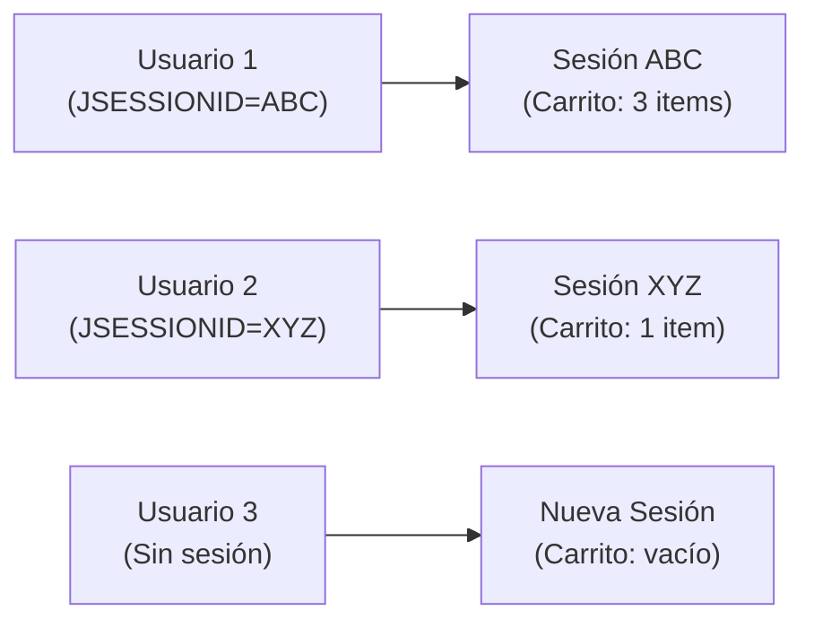

- [4. Estado, Seguridad y Funcionalidades Avanzadas](#4-estado-seguridad-y-funcionalidades-avanzadas)
    - [4.1 Gestión del Estado de la Aplicación](#41-gestión-del-estado-de-la-aplicación)
        - [4.1.1 Sesiones](#411-sesiones)
        - [4.1.2 Cookies](#412-cookies)
    - [4.2 Autenticación de Usuarios](#42-autenticación-de-usuarios)
        - [4.2.1 El Mecanismo: Spring Security](#421-el-mecanismo-spring-security)
        - [4.2.2 Seguridad a Nivel de Método](#422-seguridad-a-nivel-de-método)
        - [4.2.3 Protección CSRF (Cross-Site Request Forgery)](#423-protección-csrf-cross-site-request-forgery)
    - [4.3 Variables Globales con @ControllerAdvice](#43-variables-globales-con-controlleradvice)

# 4. Estado, Seguridad y Funcionalidades Avanzadas

## 4.1 Gestión del Estado de la Aplicación

HTTP es un protocolo "sin estado" (stateless). El servidor olvida quién eres en cada petición. Para "recordar" al usuario, necesitamos mecanismos de estado.

### 4.1.1 Sesiones

Una **Sesión** es un "almacén" de datos temporal en el **servidor** asociado a un usuario único.

- **Ventaja:** Es segura (los datos están en el servidor, no en el cliente) y puede almacenar objetos Java complejos.
- **Funcionamiento:** Cuando un usuario visita la web por primera vez, Spring crea una sesión y le envía al cliente una cookie llamada JSESSIONID. En las siguientes peticiones, el cliente envía esta cookie, y Spring usa el ID para recuperar el almacén de datos (la sesión) de ese usuario.

El uso más común es un **carrito de la compra**.

**Controlador del Carrito:**

```java
@Controller  
@RequestMapping("/carrito")  
public class CarritoController {

    @Autowired  
    private ProductoServicio productoServicio;

    // Usamos un mecanismo (Sesión) para mantener el estado  
    @GetMapping("/agregar/{id}")  
    public String agregarProducto(  
        @PathVariable Long id,  
        HttpSession session, // 1. Inyectamos la sesión HTTP  
        RedirectAttributes redirectAttributes  
    ) {  
        // 2. Obtenemos el carrito de la sesión (o creamos uno nuevo)  
        Map<Long, ItemCarrito> carrito = obtenerCarrito(session);  
          
        Producto producto = productoServicio.findById(id);  
          
        // 3. Modificamos el estado (lógica del carrito)  
        if (carrito.containsKey(id)) {  
            carrito.get(id).incrementarCantidad();  
        } else {  
            carrito.put(id, new ItemCarrito(producto, 1));  
        }  
          
        // 4. Guardamos el estado actualizado EN LA SESIÓN  
        session.setAttribute("carrito", carrito);  
          
        redirectAttributes.addFlashAttribute("mensajeExito", "Producto agregado al carrito");  
        return "redirect:/productos";  
    }

    // Método para invalidar la sesión   
    @GetMapping("/finalizar")  
    public String finalizar(HttpSession session) {  
        // ... procesar compra ...  
          
        session.removeAttribute("carrito"); // Limpiamos solo el carrito  
        // O  
        session.invalidate(); // Destruimos la sesión completa (en logout)  
          
        return "redirect:/compra/exito";  
    }

    // Método auxiliar privado para obtener el carrito de forma segura  
    private Map<Long, ItemCarrito> obtenerCarrito(HttpSession session) {  
        @SuppressWarnings("unchecked")  
        Map<Long, ItemCarrito> carrito =   
            (Map<Long, ItemCarrito>) session.getAttribute("carrito");  
          
        if (carrito == null) {  
            // Si no existe, lo creamos y lo guardamos en sesión  
            carrito = new HashMap<>();  
            session.setAttribute("carrito", carrito);  
        }  
        return carrito;  
    }  
}
```

**Mecanismos Alternativos de Sesión en Spring:**

- **`@SessionAttribute`:** Anotación en un parámetro de método para leer un atributo de sesión *existente*. Es solo para leer, no para escribir.

```java
@GetMapping("/ver")  
public String verCarrito(  
    @SessionAttribute(name = "carrito", required = false) Map<Long, ItemCarrito> carrito,  
    Model model  
) {  
    if (carrito == null) {  
        carrito = new HashMap<>();  
    }  
    model.addAttribute("carrito", carrito);  
    return "carrito/ver";  
}
```

- **`@SessionAttributes` (en la Clase):** Anotación a nivel de `@Controller` que le dice a Spring: "guarda automáticamente en sesión los atributos del Model que se llamen así". Es útil para formularios de varios pasos.

```java
@Controller  
@RequestMapping("/registro")  
@SessionAttributes("registroForm") // Mantiene "registroForm" en sesión  
public class RegistroController {

    @GetMapping("/paso1")  
    public String paso1(Model model) {  
        model.addAttribute("registroForm", new RegistroForm());  
        return "registro/paso1";  
    }

    @PostMapping("/paso1")  
    public String procesarPaso1(@ModelAttribute("registroForm") RegistroForm form) {  
        // El 'form' se guarda en sesión automáticamente  
        return "redirect:/registro/paso2";  
    }

    @GetMapping("/paso2")  
    public String paso2(@ModelAttribute("registroForm") RegistroForm form) {  
        // El 'form' se recupera de la sesión automáticamente  
        return "registro/paso2";  
    }

    @PostMapping("/finalizar")  
    public String finalizar(  
        @ModelAttribute("registroForm") RegistroForm form,  
        SessionStatus status // Para limpiar  
    ) {  
        usuarioServicio.registrar(form);  
        status.setComplete(); // Limpia el 'registroForm' de la sesión  
        return "redirect:/login";  
    }  
}
```

📝 **Nota del Profesor**: La sesión HTTP es como una mochila que el servidor le da a cada usuario. Mientras el usuario siga visitando la web, la mochila se mantiene. Cuando cierra el navegador o transcurre el timeout, se pierde.

💡 **Tip del Examinador**: La sesión se almacena en el servidor, la cookie solo contiene el ID. Esto es más seguro que almacenar datos sensibles en cookies.

⚠️ **Advertencia**: Las sesiones consumen memoria del servidor. En aplicaciones con muchos usuarios, considera usar sesiones distribuidas (Redis) o reducir el timeout.



### 4.1.2 Cookies

Las **Cookies** son el otro mecanismo principal de estado.

- **Almacenamiento en el Cliente:** A diferencia de las sesiones, los datos de las cookies se almacenan **en el navegador del cliente**.
- **Ventajas:** No consumen memoria del servidor. Útiles para datos no sensibles (preferencias, recordar nombre).
- **Desventajas:** Inseguras (el usuario puede ver y modificar los datos), limitadas en tamaño. **Nunca** almacenes un ID de usuario, rol o contraseña en una cookie.

El uso más común es para la **Internacionalización** (i18n), es decir, recordar el idioma del usuario.

**Configuración de i18n con CookieLocaleResolver:**

```java
@Configuration  
public class ConfiguracionI18n implements WebMvcConfigurer {  
      
    @Bean  
    public LocaleResolver localeResolver() {  
        // Usamos una Cookie para almacenar la preferencia  
        CookieLocaleResolver clr = new CookieLocaleResolver("idioma_pref");  
        clr.setDefaultLocale(new Locale("es"));  
        clr.setCookieMaxAge(30 * 24 * 60 * 60); // 30 días  
        return clr;  
    }  
      
    @Bean  
    public LocaleChangeInterceptor localeChangeInterceptor() {  
        // Un interceptor que busca el parámetro "lang" en la URL (ej. ?lang=en)  
        LocaleChangeInterceptor lci = new LocaleChangeInterceptor();  
        lci.setParamName("lang");  
        return lci;  
    }  
      
    @Override  
    public void addInterceptors(InterceptorRegistry registry) {  
        registry.addInterceptor(localeChangeInterceptor());  
    }  
}
```

Ahora, cuando un usuario cambia de idioma, esa preferencia se guarda en una cookie en su navegador durante 30 días.

📝 **Nota del Profesor**: Las cookies son como pósits en el frigorífico. El cliente las tiene (no el servidor), puede verlas y cambiarlas. ¡No pongas secretos en pósits!

## 4.2 Autenticación de Usuarios

### 4.2.1 El Mecanismo: Spring Security

Usamos **Spring Security**, el estándar de la industria en Java. Es un "muro" de "filtros" (Filter Chain) que intercepta *todas* las peticiones antes de que lleguen a nuestro Controller. Su trabajo es gestionar la autenticación (quién eres) y la autorización (qué puedes hacer).

**Configuración:**

```java
@Configuration  
@EnableWebSecurity  
@EnableMethodSecurity(prePostEnabled = true) // Activa la seguridad por método  
public class SeguridadConfig {  
      
    @Bean  
    public SecurityFilterChain filterChain(HttpSecurity http) throws Exception {  
        http  
            .authorizeHttpRequests(auth -> auth  
                .requestMatchers("/", "/public/**", "/css/**", "/images/**", "/error").permitAll()  
                // Rutas de Admin (solo rol ADMIN)  
                .requestMatchers("/admin/**").hasAuthority("ADMIN")  
                // Rutas de Moderador  
                .requestMatchers("/moderador/**").hasAnyAuthority("ADMIN", "MODERATOR")  
                // El resto (requiere autenticación)  
                .anyRequest().authenticated()  
            )  
            .formLogin(form -> form  
                .loginPage("/auth/login") // URL de nuestro formulario de login  
                .defaultSuccessUrl("/")   // A dónde ir tras loguearse  
                .permitAll()              // El login es público  
            )  
            .logout(logout -> logout  
                .logoutUrl("/auth/logout")  
                .logoutSuccessUrl("/")  
                .permitAll()  
            );  
          
        return http.build();  
    }  
}
```

📝 **Nota del Profesor**: Spring Security es como el portero de una discoteca. Examina todas las peticiones, decide quién puede entrar (autenticación) y qué zonas puede visitar (autorización).

### 4.2.2 Seguridad a Nivel de Método

Aunque las rutas ya están protegidas, podemos (y debemos) añadir una capa extra de seguridad directamente en los métodos del Controller.

```java
@Controller  
@RequestMapping("/admin")  
public class AdminController {  
      
    // Si un usuario no-ADMIN intenta entrar, Spring Security lo bloqueará  
    @PreAuthorize("hasAuthority('ADMIN')")   
    @GetMapping("/dashboard")  
    public String dashboard(Model model) {  
        // Solo accesible para ADMIN  
        return "admin/dashboard";  
    }  
}
```

### 4.2.3 Protección CSRF (Cross-Site Request Forgery)

La **falsificación de peticiones en sitios cruzados** es un ataque donde un sitio malicioso engaña a tu navegador para que envíe una petición a nuestra app sin tu consentimiento (ej. un POST a `/productos/eliminar/5`).

Spring Security nos protege de esto **automáticamente** por defecto.

- **Cómo funciona:** Spring genera un token único y secreto (el "token CSRF") y lo guarda en la sesión del usuario.
- **Requisito:** **Todos** los formularios POST, PUT, DELETE deben incluir este token secreto. Si no lo incluyen, Spring Security **rechazará la petición (Error 403 Forbidden)**.

**En la Vista Pebble:**

```twig
<form method="POST" action="/productos/guardar">  
    {# Incluir el token CSRF es OBLIGATORIO #}  
    {# 'csrfParamName' suele ser "_csrf" y 'csrfToken' es el valor #}  
    <input type="hidden" name="{{ csrfParamName }}" value="{{ csrfToken }}">
      
    {{ input('nombre', 'Nombre', producto.nombre) }}  
    {{ input('precio', 'Precio', producto.precio, type='number') }}  
      
    <button type="submit" class="btn btn-primary">Guardar</button>  
</form>
```

📝 **Nota del Profesor**: El token CSRF es como una firma en un cheque. Sin la firma correcta, el banco (servidor) rechaza el cheque (petición).

⚠️ **Advertencia**: Si olvidas incluir el token CSRF, tus formularios fallarán con Error 403. Es un error común al empezar con Spring Security.

## 4.3 Variables Globales con @ControllerAdvice

**Este es un concepto crucial que une todo.**

- **El Problema:** ¿Cómo sabe el `navbar.peb` (que está en *todas* las páginas) si el usuario está logueado? ¿Cómo sabe el contador del carrito? ¿Y cómo obtienen los formularios el token CSRF?
- **La Mala Solución:** Añadir `model.addAttribute("isAuthenticated", ...)`, `model.addAttribute("cartItemCount", ...)` y `model.addAttribute("csrfToken", ...)` en **todos los métodos de todos los controladores**. Esto es una violación terrible del principio DRY.

**La Solución Elegante: @ControllerAdvice**

`@ControllerAdvice` es una anotación de Spring para una clase que "aconseja" a todos los controladores.

Podemos usar métodos anotados con `@ModelAttribute` dentro de esta clase. Estos métodos se ejecutarán **antes de CUALQUIER método de CUALQUIER controlador**, y sus resultados se añadirán automáticamente al Model de *todas* las peticiones.

**GlobalControllerAdvice.java:**

```java
@ControllerAdvice  
public class GlobalControllerAdvice {

    @Autowired  
    private ProductService productService; // Para calcular el total del carrito

    // --- Variables de Autenticación ---

    @ModelAttribute("currentUser")  
    public User getCurrentUser(Authentication authentication) {  
        if (authentication != null && authentication.isAuthenticated()  
                && !(authentication.getPrincipal() instanceof String)) {  
            return (User) authentication.getPrincipal(); // Devuelve el objeto User  
        }  
        return null; // Devuelve null si no está logueado  
    }

    @ModelAttribute("isAuthenticated")  
    public boolean isAuthenticated(Authentication authentication) {  
        return authentication != null && authentication.isAuthenticated()  
                && !(authentication.getPrincipal() instanceof String);  
    }

    @ModelAttribute("isAdmin")  
    public boolean isAdmin(Authentication authentication) {  
        if (isAuthenticated(authentication)) {  
            User user = (User) authentication.getPrincipal();  
            return user.getRol().equals("ADMIN");  
        }  
        return false;  
    }

    // --- Variables de Estado (Sesión del Carrito) ---

    @ModelAttribute("cartItemCount")  
    public int getCartItemCount(HttpServletRequest request) {  
        HttpSession session = request.getSession(false); // false = no crear si no existe  
        if (session != null) {  
            @SuppressWarnings("unchecked")  
            List<Long> carrito = (List<Long>) session.getAttribute("carrito");  
            return (carrito != null) ? carrito.size() : 0;  
        }  
        return 0;  
    }

    // --- Variables de Seguridad ---

    @ModelAttribute("csrfToken")  
    public String getCsrfToken(HttpServletRequest request) {  
        CsrfToken csrfToken = (CsrfToken) request.getAttribute(CsrfToken.class.getName());  
        return csrfToken != null ? csrfToken.getToken() : "";  
    }

    @ModelAttribute("csrfParamName")  
    public String getCsrfParamName(HttpServletRequest request) {  
        CsrfToken csrfToken = (CsrfToken) request.getAttribute(CsrfToken.class.getName());  
        return csrfToken != null ? csrfToken.getParameterName() : "_csrf";  
    }  
      
    // --- Variables Globales de Configuración ---  
      
    @ModelAttribute("appName")  
    public String getAppName() {  
        return "Mi E-Commerce DAW";  
    }  
}
```

**Resultado:**

Gracias a esta clase, CUALQUIER plantilla Pebble (como `navbar.peb`) puede usar estas variables en cualquier momento, sabiendo que siempre existirán:

```twig
{# templates/fragments/navbar.peb #}  
<nav class="navbar navbar-dark bg-dark">  
    <a class="navbar-brand" href="/">{{ appName }}</a>  
    <ul class="navbar-nav ms-auto">  
        {# Variable de estado de sesión #}  
        <li class="nav-item">  
            <a class="nav-link" href="/carrito">  
                <i class="bi bi-cart"></i> Carrito  
                  
                <span class="badge bg-danger">{{ cartItemCount }}</span>  
                  
            </a>  
        </li>  
          
        {# Variables de autenticación #}  
          
            <li class="nav-item">  
                <span class="navbar-text">Hola, {{ currentUser.nombre }}</span>  
            </li>  
              
                <li class="nav-item"><a class="nav-link" href="/admin">Admin</a></li>  
              
            <li class="nav-item">  
                <a class="nav-link" href="/auth/logout">Logout</a>  
            </li>  
          
            <li class="nav-item">  
                <a class="nav-link" href="/auth/login">Login</a>  
            </li>  
          
    </ul>  
</nav>
```

📝 **Nota del Profesor**: `@ControllerAdvice` es como un secreatario que prepara automáticamente los documentos que necesitan todos los departamentos. ¡Ahorra un montón de trabajo repetitivo!

💡 **Tip del Examinador**: En el examen, si necesitáis una variable en todas las vistas (contador del carrito, usuario logueado), usad `@ControllerAdvice`. No hagáis `addAttribute` en cada método.
