- [5. Tecnologías Híbridas, Pruebas y Despliegue](#5-tecnologías-híbridas-pruebas-y-despliegue)
    - [5.1 Uniendo Servidor y Cliente: AJAX y REST](#51-uniendo-servidor-y-cliente-ajax-y-rest)
    - [5.2 Pruebas y Herramientas](#52-pruebas-y-herramientas)
    - [5.3 Configuración y Despliegue](#53-configuración-y-despliegue)
    - [5.4 Funcionalidades Avanzadas](#54-funcionalidades-avanzadas)
        - [5.4.1 Subida de Archivos](#541-subida-de-archivos)
        - [5.4.2 Manejo de Errores (@ExceptionHandler)](#542-manejo-de-errores-exceptionhandler)
        - [5.4.3 Paginación (Pageable y Page)](#543-paginación-pageable-y-page)
        - [5.4.4 Optimización de Paginación: Page vs Slice](#544-optimización-de-paginación-page-vs-slice)

# 5. Tecnologías Híbridas, Pruebas y Despliegue

## 5.1 Uniendo Servidor y Cliente: AJAX y REST

No toda la interacción web requiere una recarga completa de la página.

- **Ventajas de unir ambas tecnologías:** Podemos usar JavaScript para realizar una acción (como añadir a "Favoritos") sin recargar. JavaScript envía una petición "silenciosa" (AJAX/REST/Fetch) al servidor, el servidor responde solo con los datos necesarios (en formato **JSON**), y JavaScript actualiza un trocito de la página.

- **AJAX:** Asynchronous JavaScript And XML (aunque hoy en día usamos JSON en lugar de XML). Lo hacemos con la API Fetch o librerías como Axios.
- **REST:** Representational State Transfer. Es un estilo arquitectónico para diseñar APIs web. En lugar de devolver vistas HTML, el servidor devuelve datos en formato JSON.

Para esto, creamos un tipo especial de controlador en Spring: un `@RestController`.

- **`@Controller`:** Devuelve un String (nombre de la vista) y Spring usa Pebble para generar HTML.
- **`@RestController`:** Devuelve un Objeto Java (o Map, List) y Spring lo convierte automáticamente a **JSON**. No usa Pebble.

**Controlador REST:**

```java
@RestController // ¡No @Controller! Indica que devuelve JSON.  
@RequestMapping("/api/favoritos") // Se suele usar un prefijo '/api'  
public class FavoriteController {  
      
    @Autowired  
    private FavoriteService favoriteService;

    // Endpoint para añadir a favoritos  
    @PostMapping("/add/{productoId}")  
    public ResponseEntity<?> addFavorito(@PathVariable Long productoId, Authentication auth) {  
        User usuario = (User) auth.getPrincipal();  
          
        favoriteService.addFavorito(usuario, productoId);  
          
        // Devuelve una respuesta JSON  
        Map<String, Object> response = new HashMap<>();  
        response.put("success", true);  
        response.put("isFavorite", true);  
        return ResponseEntity.ok(response);  
    }

    @DeleteMapping("/remove/{productoId}")  
    public ResponseEntity<?> removeFavorito(@PathVariable Long productoId, Authentication auth) {  
        User usuario = (User) auth.getPrincipal();  
          
        favoriteService.removeFavorito(usuario, productoId);  
          
        Map<String, Object> response = new HashMap<>();  
        response.put("success", true);  
        response.put("isFavorite", false);  
        return ResponseEntity.ok(response);  
    }  
}
```

**JavaScript (en static/js/main.js):**

```js
// JavaScript en el cliente que consume la API del servidor  
function toggleFavorite(productoId, buttonElement) {  
    const isFavorite = buttonElement.classList.contains('is-favorite');  
    const method = isFavorite ? 'DELETE' : 'POST';  
    const url = `/api/favoritos/${isFavorite ? 'remove' : 'add'}/${productoId}`;  
      
    // Obtenemos el token CSRF (debe estar en un <meta> tag)  
    const csrfToken = document.querySelector('meta[name="_csrf"]').getAttribute('content');  
    const csrfHeader = document.querySelector('meta[name="_csrf_header"]').getAttribute('content');

    fetch(url, {  
        method: method,  
        headers: {  
            'Content-Type': 'application/json',  
            [csrfHeader]: csrfToken // ¡AJAX también necesita CSRF!  
        }  
    })  
    .then(response => response.json())  
    .then(data => {  
        if (data.success) {  
            // Modificación dinámica del contenido  
            if (data.isFavorite) {  
                buttonElement.classList.add('is-favorite');  
                buttonElement.innerHTML = '<i class="bi bi-heart-fill"></i> Quitar de Favoritos';  
            } else {  
                buttonElement.classList.remove('is-favorite');  
                buttonElement.innerHTML = '<i class="bi bi-heart"></i> Añadir a Favoritos';  
            }  
        }  
    })  
    .catch(err => console.error('Error en AJAX:', err));  
}
```

📝 **Nota del Profesor**: AJAX es como pedir algo a un camarero sin levantarte de la mesa. El camarero va a la cocina (servidor), trae lo que necesitas (JSON), y tú sigues sentado (sin recargar la página).

💡 **Tip del Examinador**: Los endpoints REST deben devolver JSON, no HTML. Usa `@RestController` para APIs y `@Controller` para vistas tradicionales.

```mermaid
sequenceDiagram
    participant User as Usuario
    participant JS as JavaScript
    participant API as REST Controller
    participant DB as Base de Datos
    
    User->>JS: Clic en "Me gusta"
    JS->>API: POST /api/favoritos/add/123
    API->>DB: Guardar favorito
    DB-->>API: OK
    API-->>JS: {"success": true, "isFavorite": true}
    JS->>JS: Actualizar corazón (sin recargar)
    JS-->>User: Icono cambiado
```



## 5.2 Pruebas y Herramientas

Una aplicación profesional requiere pruebas automáticas.

### Pruebas Unitarias y de Integración

Spring Boot incluye herramientas potentes para pruebas. Podemos probar nuestros Controllers sin necesidad de un servidor real usando `MockMvc`.

- **Prueba Unitaria (Test Unitario):** Prueba una clase de forma aislada (ej. probar un método del Service falseando el Repository con Mockito).
- **Prueba de Integración:** Prueba cómo varias capas interactúan (ej. probar que un Controller llama al Service y este al Repository). MockMvc es para esto.

```java
import static org.springframework.test.web.servlet.request.MockMvcRequestBuilders.get;  
import static org.springframework.test.web.servlet.result.MockMvcResultMatchers.*;  
import static org.springframework.security.test.web.servlet.request.SecurityMockMvcRequestPostProcessors.csrf;

@WebMvcTest // Carga solo el contexto web para este Controller  
@AutoConfigureMockMvc // Configura MockMvc  
class ProductControllerTest {  
      
    @Autowired  
    private MockMvc mockMvc; // Simula ser un navegador que hace peticiones HTTP  
      
    @MockBean // Simula el Servicio (no usamos la BBDD real)  
    private ProductService productService;  
      
    @MockBean // Necesario si la seguridad está activa  
    private UserDetailsService userDetailsService;

    @Test  
    void testListarProductos_DevuelveVistaYModeloCorrectos() throws Exception {  
        // 1. Preparación   
        // Simulamos la respuesta del servicio  
        List<Product> productosSimulados = Arrays.asList(  
            new Product("iPhone", 1000f),  
            new Product("Samsung", 900f)  
        );  
        when(productService.findAll()).thenReturn(productosSimulados);  
           
        // 2. Ejecución y Verificación   
        mockMvc.perform(get("/productos")) // Simula una petición GET /productos  
                .andExpect(status().isOk()) // Espera que la respuesta sea HTTP 200   
                .andExpect(view().name("productos/lista")) // Espera que se devuelva la vista "productos/lista"  
                .andExpect(model().attributeExists("productos")) // Espera que el Model contenga un atributo "productos"  
                .andExpect(model().attribute("productos", hasSize(2))); // Espera que ese atributo tenga 2 elementos  
    }  
      
    @Test  
    void testGuardarProducto_ConErrorDeValidacion() throws Exception {  
        // 1. Preparación   
        // Enviamos un producto con un nombre demasiado corto (falla @Size(min=3))  
           
        // 2. Ejecución y Verificación   
        mockMvc.perform(post("/productos/guardar")  
                    .param("nombre", "a") // Nombre inválido  
                    .param("precio", "100")  
                    .with(csrf()) // Añadimos un token CSRF falso para pasar el filtro  
                )  
                .andExpect(status().isOk()) // Espera HTTP 200   
                .andExpect(view().name("productos/form")) // Espera que nos DEVUELVA al formulario  
                .andExpect(model().hasErrors()); // Espera que el modelo tenga errores de validación  
    }  
}
```

📝 **Nota del Profesor**: Las pruebas automáticas son como los entrenamientos de un athlete. Cuanto más entrenes (pruebes), mejor funcionará en la competición (producción). ¡No te saltes los tests!

### Documentación

El código debe ser documentado:

- **Java:** Usamos Javadoc `/** ... */` en clases y métodos públicos.
- **Pebble:** Usamos comentarios `{# ... #}` para explicar lógica de vista compleja.
- **API:** Usamos Swagger/OpenAPI para documentar endpoints REST.
- **Proyecto:** Usamos archivos README.md para explicar la arquitectura, instalación y despliegue.

## 5.3 Configuración y Despliegue

### Configuración

La configuración de la aplicación (BBDD, cache, Pebble, tamaño de archivos) se gestiona centralizadamente en `src/main/resources/application.properties`.

```properties
# Configuración del Servidor  
server.port=8080  
server.servlet.session.timeout=30m # Timeout de sesión (30 minutos)

# Configuración de Pebble  
pebble.cache=false      # Desactivar cache en desarrollo (¡poner a 'true' en producción!)  
pebble.suffix=.peb      # Extensión de archivos  
pebble.defaultLocale=es_ES # Idioma por defecto 

# Configuración de subida de archivos  
spring.servlet.multipart.max-file-size=10MB  
spring.servlet.multipart.max-request-size=10MB

# Configuración de Base de Datos (Perfil de Desarrollo 'dev')  
spring.profiles.active=dev

#--- Perfil DEV (H2 en memoria) ---  
spring.config.activate.on-profile=dev  
spring.datasource.url=jdbc:h2:mem:ecommercedb  
spring.datasource.driverClassName=org.h2.Driver  
spring.datasource.username=sa  
spring.datasource.password=password  
spring.jpa.database-platform=org.hibernate.dialect.H2Dialect  
spring.jpa.hibernate.ddl-auto=update # Actualiza el esquema al arrancar

#--- Perfil PROD ---  
spring.config.activate.on-profile=prod  
spring.datasource.url=jdbc:postgresql://db-host:5432/ecommercedb  
spring.datasource.driverClassName=org.postgresql.Driver  
spring.datasource.username=${DB_USER} # Lee de variables de entorno  
spring.datasource.password=${DB_PASS} # Lee de variables de entorno  
spring.jpa.database-platform=org.hibernate.dialect.PostgreSQLDialect  
spring.jpa.hibernate.ddl-auto=validate # Valida el esquema, no lo cambia  
pebble.cache=true # Activa la cache en producción
```

### Despliegue en Entornos JVM

1. **Generación de Paquete:**
   Usamos Gradle (o Maven) para empaquetar toda la aplicación (Java, Pebble, Spring, y el servidor Tomcat) en un único archivo `.jar` ejecutable.

   ```bash
   # En la terminal, en la raíz del proyecto
   ./gradlew bootJar
   ```

   Esto crea un archivo en `build/libs/mi-aplicacion-0.0.1-SNAPSHOT.jar`.

2. **Ejecución:**
   Este `.jar` es un "ejecutable de JVM". Se puede correr en cualquier máquina que tenga Java (la JVM) instalada.

   ```bash
   # Ejecutamos la aplicación. Por defecto usa el perfil 'dev'
   java -jar build/libs/mi-aplicacion-0.0.1-SNAPSHOT.jar

   # Ejecutamos la aplicación en modo Producción
   java -jar -Dspring.profiles.active=prod -DDB_USER=mi_usuario -DDB_PASS=mi_pass build/libs/mi-aplicacion-0.0.1-SNAPSHOT.jar
   ```

3. **Despliegue en Contenedores:**
   La forma moderna de desplegar es usando Docker. Creamos un Dockerfile que describe cómo construir una imagen que contenga nuestra app, y un `docker-compose.yml` para orquestar el despliegue.

📝 **Nota del Profesor**: El `.jar` ejecutable es como una lata de conserva. Contiene todo lo necesario (comida + olla + fuego) y solo necesitas un abridor (JVM) para abrirla.

💡 **Tip del Examinador**: En producción, activa `pebble.cache=true` y usa `spring.jpa.hibernate.ddl-auto=validate`. Esto mejora rendimiento y previene cambios accidentales en la BBDD.

## 5.4 Funcionalidades Avanzadas

### 5.4.1 Subida de Archivos

Para subir archivos (ej. imágenes de producto), usamos `MultipartFile`.

**Controlador:**

```java
@PostMapping("/guardar")  
public String guardarProducto(  
    @Valid @ModelAttribute("producto") Producto producto,  
    BindingResult result,  
    @RequestParam("file") MultipartFile file, // 1. Recibimos el archivo  
    RedirectAttributes redirectAttributes  
) {  
    if (result.hasErrors()) {  
        return "productos/form";  
    }  
      
    // 2. Lógica para guardar el archivo   
    if (!file.isEmpty()) {  
        try {  
            String nombreArchivo = storageService.store(file);  
            producto.setImagen(nombreArchivo);  
        } catch (Exception e) {  
            redirectAttributes.addFlashAttribute("error", "Error al subir el archivo");  
            return "redirect:/productos/nuevo";  
        }  
    }  
      
    productoServicio.guardar(producto);  
    redirectAttributes.addFlashAttribute("mensajeExito", "Producto guardado");  
    return "redirect:/productos";  
}
```

**Vista:**

```twig
{# OJO: El formulario DEBE tener enctype #}  
<form method="POST" action="/productos/guardar" enctype="multipart/form-data">  
    <input type="hidden" name="{{ csrfParamName }}" value="{{ csrfToken }}">
      
    {{ input('nombre', 'Nombre', producto.nombre) }}  
      
    <div class="mb-3">  
        <label for="file" class="form-label">Imagen del Producto</label>  
        <input type="file" class="form-control" id="file" name="file" accept="image/*">  
    </div>  
      
    <button type="submit" class="btn btn-primary">Guardar</button>  
</form>
```

⚠️ **Advertencia**: ¡El formulario DEBE tener `enctype="multipart/form-data"`! Sin esto, el archivo no se enviará correctamente.

### 5.4.2 Manejo de Errores (@ExceptionHandler)

쯈ué pasa si un usuario pide un producto que no existe (`/productos/999`)? El `findById` devolverá null y la plantilla fallará con un `NullPointerException`.

Podemos manejar estas excepciones de forma centralizada.

**1. Excepción Personalizada:**

```java
public class ProductoNotFoundException extends RuntimeException {  
    public ProductoNotFoundException(Long id) {  
        super("Producto no encontrado con ID: " + id);  
    }  
}
```

**2. Lanzarla en el Servicio:**

```java
@Service  
public class ProductoService {  
    public Producto findById(Long id) {  
        return repositorio.findById(id)  
            .orElseThrow(() -> new ProductoNotFoundException(id));  
    }  
}
```

**3. Capturarla en el Controlador:**

```java
@Controller  
public class ProductoController {  
      
    // ...

    @ExceptionHandler(ProductoNotFoundException.class)  
    public String handleProductoNotFound(ProductoNotFoundException ex, Model model) {  
        model.addAttribute("error", ex.getMessage());  
        return "error/404";  
    }  
}
```

📝 **Nota del Profesor**: Las excepciones personalizadas son como ladridos de alarma. avisam de que algo específico ha ido mal, en lugar de un genérico "¡Error!".

### 5.4.3 Paginación (Pageable y Page)

쯈ué pasa si tenemos 10.000 productos? No podemos pasarlos todos a la vista. Necesitamos **paginación**. Spring Data JPA lo hace increíblemente fácil.

**1. Cambiar el Repositorio:**

```java
public interface ProductoRepository extends JpaRepository<Producto, Long> {  
    Page<Producto> findAll(Pageable pageable);  
    Page<Producto> findByNombreContaining(String nombre, Pageable pageable);  
}
```

**2. Cambiar el Controlador:**

```java
@GetMapping("/productos")  
public String listar(  
    @RequestParam(defaultValue = "0") int page, // Nº de página  
    @RequestParam(defaultValue = "10") int size, // Tamaño de página  
    @RequestParam(required = false) String q // Parámetro de búsqueda  
) {  
    Pageable pageable = PageRequest.of(page, size, Sort.by("nombre").ascending());  
      
    Page<Producto> paginaProductos;  
      
    if (q != null && !q.isEmpty()) {  
        paginaProductos = productoServicio.buscar(q, pageable);  
    } else {  
        paginaProductos = productoServicio.findAll(pageable);  
    }  
      
    model.addAttribute("paginaProductos", paginaProductos);  
    model.addAttribute("q", q);  
      
    return "productos/lista_paginada";  
}
```

**3. La Vista:**

```twig
{# ... bucle 'for' igual que antes, pero usando 'paginaProductos.content' ... #}  
  
    {# ... tarjeta de producto ... #}  


{# --- Controles de Paginación --- #}  
<nav aria-label="Navegación de productos">  
    <ul class="pagination">  
          
            <li class="page-item">  
                <a class="page-link" href="?page={{ paginaProductos.number - 1 }}&size={{ paginaProductos.size }}">Anterior</a>  
            </li>  
          
          
          
            <li class="page-item {{ i == paginaProductos.number ? 'active' : '' }}">  
                <a class="page-link" href="?page={{ i }}&size={{ paginaProductos.size }}">{{ i + 1 }}</a>  
            </li>  
          
          
          
            <li class="page-item">  
                <a class="page-link" href="?page={{ paginaProductos.number + 1 }}&size={{ paginaProductos.size }}">Siguiente</a>  
            </li>  
          
    </ul>  
</nav>
```

### 5.4.4 Optimización de Paginación: Page vs Slice

**Nota Avanzada del Profesor:**

Cuando usas `Page<T>` en tu repositorio, Spring Data JPA ejecuta **dos** consultas SQL:

1. Una consulta para obtener los datos de la página (ej. `SELECT * FROM producto LIMIT 10 OFFSET 0`).
2. Una consulta de conteo para saber el total de elementos (ej. `SELECT COUNT(*) FROM producto`).

Esta consulta `COUNT(*)` puede ser muy lenta en tablas con millones de filas.

Si solo necesitas saber si hay una página *siguiente*, pero no necesitas el número total de páginas, puedes usar `Slice<T>` en lugar de `Page<T>`.

```java
// Repositorio  
Slice<Producto> findByCategoria(String categoria, Pageable pageable);

// Servicio  
Slice<Producto> productos = service.findByCategoria("TECNOLOGIA", pageable);

// Vista  
  
    <button id="cargarMas">Cargar más</button>  

```

`Slice<T>` es mucho más rápido porque **no ejecuta la consulta `COUNT(*)`**. Solo pide `size + 1` elementos para saber si hay una página siguiente. Esto es ideal para interfaces de usuario con "Cargar más" o scroll infinito.

📝 **Nota del Profesor**: `Slice` es para cuando solo te importa "hay más", `Page` es para cuando te importa "cuántos hay en total". Elige sabiamente según tu caso de uso.
