- [9. Resumen](#9-resumen)
  - [9.1. Resumen Global](#91-resumen-global)
  - [9.2. Mapa Mental de la Unidad](#92-mapa-mental-de-la-unidad)
  - [9.3. Checklist de Evaluación](#93-checklist-de-evaluación)

# 9. Resumen

## 9.1. Resumen Global

En esta unidad hemos aprendido a desarrollar paginas web dinamicas en entorno servidor utilizando Java con Spring Boot y Pebble.

Hemos aprendido que:

1. **Arquitectura MVC:** Separa la aplicacion en Modelo (datos y logica), Vista (presentacion) y Controlador (peticiones).
2. **Spring Boot:** Framework que simplifica la configuracion y el despliegue de aplicaciones Java.
3. **Pebble:** Motor de plantillas que permite generar HTML dinamico con sintaxis limpia.
4. **Controladores:** Gestionan las peticiones HTTP y conectan con la logica de negocio.
5. **Validacion:** Bean Validation asegura que los datos son correctos antes de procesarlos.
6. **Estado:** Las sesiones HTTP permiten recordar al usuario entre peticiones.
7. **Seguridad:** Spring Security gestiona autenticacion y autorizacion.
8. **Despliegue:** Los perfiles permiten configurar diferentes entornos (dev, prod).

## 9.2. Mapa Mental de la Unidad

```mermaid
graph TD
    UD03["UD03: Spring Boot y Pebble"] --> ARQ["Arquitectura MVC"]
    UD03 --> PEB["Pebble Templates"]
    UD03 --> CON["Controladores"]
    UD03 --> VAL["Validacion"]
    UD03 --> EST["Estado y Seguridad"]
    UD03 --> DES["Despliegue"]

    ARQ --> MOD["Modelo: Entity, Service, Repository"]
    ARQ --> VIS["Vista: Pebble"]
    ARQ --> CTRL["Controlador"]

    PEB --> SIN["Delimitadores"]
    PEB --> VAR["Variables y Operadores"]
    PEB --> LOG["Condicionales y Bucles"]
    PEB --> HER["Herencia"]

    CON --> GET["GetMapping"]
    CON --> POST["PostMapping"]
    CON --> MODL["Model"]
    CON --> PRG["Patron PRG"]

    VAL --> NOT["Anotaciones"]
    VAL --> VALD["Valid mas BindingResult"]

    EST --> SES["Sesiones HTTP"]
    EST --> SEC["Spring Security"]
    EST --> CSRF["Token CSRF"]

    DES --> PER["Perfiles"]
    DES --> VAR2["Variables de Entorno"]
    DES --> DOC["Docker"]
```

## 9.3. Checklist de Evaluación

Utiliza esta lista para verificar que dominas los conceptos clave antes del examen:

- [ ] **Arquitectura MVC:**
    - [ ] Distingo los tres componentes y sus responsabilidades
    - [ ] Entiendo el flujo de una peticion HTTP en Spring MVC

- [ ] **Pebble:**
    - [ ] Conozco los tres delimitadores (imprimir, logica, comentario)
    - [ ] Uso variables, condicionales y bucles
    - [ ] Aplico herencia de plantillas con extends y block

- [ ] **Controladores:**
    - [ ] Creo metodos con @GetMapping y @PostMapping
    - [ ] Uso @PathVariable y @RequestParam
    - [ ] Paso datos con Model
    - [ ] Aplico el patron PRG

- [ ] **Validacion:**
    - [ ] Anoto entidades con @NotEmpty, @Size, @Min
    - [ ] Uso @Valid en el controlador
    - [ ] Muestro errores en la vista

- [ ] **Estado y Seguridad:**
    - [ ] Gestion sesiones con HttpSession
    - [ ] Configuro Spring Security basico
    - [ ] Incluyo token CSRF en formularios

- [ ] **Despliegue:**
    - [ ] Configuro perfiles (dev, prod)
    - [ ] Uso variables de entorno
    - [ ] Genero JAR ejecutable

---

**Recuerda:** La practica es fundamental. Implementa los conceptos en el proyecto de clase.

