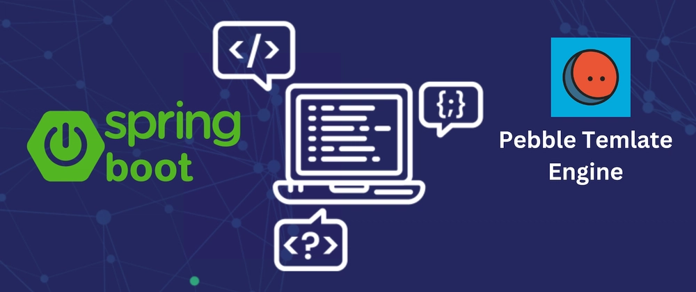

- [Desarrollo Web en Entornos Servidor - 03 - Spring Boot y Pebble](#desarrollo-web-en-entornos-servidor---03---spring-boot-y-pebble)
  - [Contenido en YouTube](#contenido-en-youtube)
  - [Contenido](#contenido)
  - [Proyecto](#proyecto)
  - [Autor](#autor)
    - [Contacto](#contacto)
  - [Licencia de uso](#licencia-de-uso)

# Desarrollo Web en Entornos Servidor - 03 - Spring Boot y Pebble

Tema 03. Desarrollo de páginas web dinámicas en JVM. 2DAW. Curso 2025-2026.

## Contenido en YouTube

- [Podcast](https://youtu.be/8eyjLtFz55I)
- [Resumen](https://youtu.be/4rako8IXxGc)
- [Manejo de Formularios](https://youtu.be/Lto449XDyUM)
- [Motor de Plantillas Pebble](https://youtu.be/FMm2BEVjOoY)
- [Gestión de Datos Globales, Estado y Seguridad](https://youtu.be/3W_vNbM94Hs)
- [Lista de Reproducción](https://www.youtube.com/watch?v=tlRgLmopS1g&list=PLGIH-7eZDbVzq51Vk4XHAgQ4fTHZVTLRl)

## Contenido
1. [Fundamentos](./01-fundamentos.md) - Generación dinámica, arquitectura MVC, flujo de petición
2. [Pebble Templates](./02-pebble.md) - Sintaxis, variables, condicionales, bucles, herencia, macros, filtros
3. [Controladores y Formularios](./03-controladores-formularios.md) - @Controller, Model, formularios, validación, patrón PRG
4. [Estado y Seguridad](./04-estado-seguridad.md) - Sesiones, cookies, Spring Security, CSRF, @ControllerAdvice
5. [Tecnologías Híbridas](./05-tecnologias-hibridas.md) - AJAX, REST, @RestController, funcionalidades avanzadas
6. [Pruebas](./06-pruebas.md) - Tests unitarios, MockMvc, integración
7. [Configuración y Despliegue](./07-configuracion-despliegue.md) - Perfiles, variables de entorno, Docker
8. [Casos Avanzados](./08-casos-avanzados.md) - GlobalControllerAdvice, email asíncrono, PDFs
9. [Resumen](./09-resumen.md) - Resumen ejecutivo, mapa mental, checklist

## Proyecto

El proyecto realizado en clase podrás seguirlo desde el repositorio de GitHub:
- [Proyecto](https://github.com/joseluisgs/WalaDawWeb-SpringBoot)

## Autor

Codificado con :sparkling_heart: por [José Luis González Sánchez](https://twitter.com/JoseLuisGS_)

### Contacto

  Cualquier cosa que necesites házmelo saber por si puedo ayudarte 💬.

   &nbsp;&nbsp;
     &nbsp;&nbsp;
         &nbsp;&nbsp;
      &nbsp;&nbsp;
      &nbsp;&nbsp;
  

## Licencia de uso

Este repositorio y todo su contenido está licenciado bajo licencia **Creative Commons**, si desea saber más, vea
la [LICENSE](https://joseluisgs.dev/docs/license/). Por favor si compartes, usas o modificas este proyecto cita a su
autor, y usa las mismas condiciones para su uso docente, formativo o educativo y no comercial.

 
JoseLuisGS
by <a xmlns:cc="http://creativecommons.org/ns#" href="https://joseluisgs.dev/" property="cc:attributionName" rel="cc:attributionURL">
José Luis González Sánchez</a> is licensed under
<a rel="license" href="http://creativecommons.org/licenses/by-nc-sa/4.0/">Creative Commons
Reconocimiento-NoComercial-CompartirIgual 4.0 Internacional License</a>. Creado a partir de la obra
en <a xmlns:dct="http://purl.org/dc/terms/" href="https://github.com/joseluisgs" rel="dct:source">https://github.com/joseluisgs</a>.
