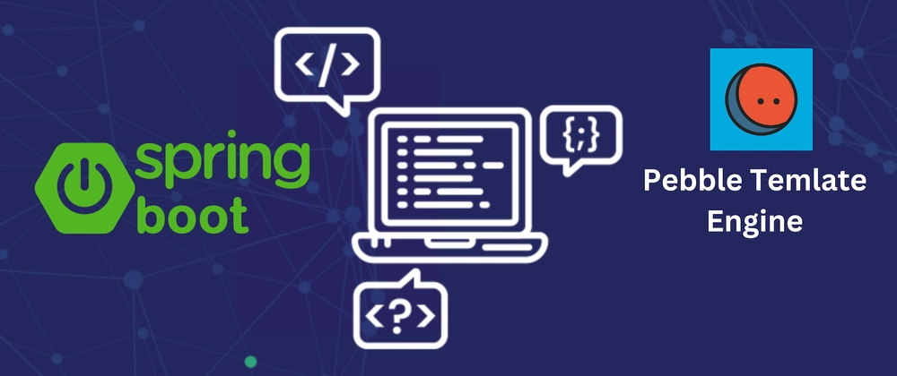

# Desarrollo Web en Entornos Servidor - 03- Desarrollo de páginas web dinámicas en JVM

Tema 03. Desarrollo de páginas web dinámicas en JVM. 2DAW. Curso 2025-2026.

- [Desarrollo Web en Entornos Servidor - 03- Desarrollo de páginas web dinámicas en JVM](#desarrollo-web-en-entornos-servidor---03--desarrollo-de-páginas-web-dinámicas-en-jvm)
- [Contenido en Youtube](#contenido-en-youtube)
  - [Proyecto](#proyecto)
  - [Contenidos específicos](#contenidos-específicos)
  - [Contenidos de la unidad](#contenidos-de-la-unidad)
  - [Referencias](#referencias)
  - [Autor](#autor)
    - [Contacto](#contacto)
  - [Licencia de uso](#licencia-de-uso)

# Contenido en Youtube
- [Podcast](https://youtu.be/8eyjLtFz55I)
- [Resumen](https://youtu.be/4rako8IXxGc)
- [Manejo de Formularios](https://youtu.be/Lto449XDyUM)
- [Motor de Plantillas Pebble](https://youtu.be/FMm2BEVjOoY)
- [Gestión de Datos Globales, Estado y Seguridad](https://youtu.be/3W_vNbM94Hs)
- [Lista de Reproducción](https://www.youtube.com/watch?v=tlRgLmopS1g&list=PLGIH-7eZDbVzq51Vk4XHAgQ4fTHZVTLRl)

## Proyecto
El proyecto realizado en clase podrás seguirlo desde el repositorio de GitHub:
- [Proyecto](https://github.com/joseluisgs/WalaDawWeb-SpringBoot)

## Contenidos específicos
- [Spring MVC](./SpringMVC.md)
- [Pebble Templates](./Pebble.md)
- [GlobalAdvice](./GlobalAdvice.md)

## Contenidos de la unidad
1. [Fundamentos de las Paginas Web Dinámicas y Spring MVC ](./fundamentos.md)
2. [Plantillas. Manejo de Pebble](./plantillas.md)
3. [Controlador, modelos y el Manejo de Formularios](./controlador-modelo-formularios.md)
4. [Estado, Seguridad y Funcionalidades Avanzadas](./estado-seguridad.md)
5. [Tecnologías Híbridas, Pruebas y Despliegue](./tecnologias-hibridas-pruebas-despliegue.md)

## Referencias
- [Spring MVC](https://spring.io/guides/gs/serving-web-content)
- [Spring MVC Tutorial](https://www.geeksforgeeks.org/java/spring-mvc/)
- [Pebble Templates](https://pebbletemplates.io/)

## Autor

Codificado con :sparkling_heart: por [José Luis González Sánchez](https://twitter.com/JoseLuisGS_)

### Contacto

  Cualquier cosa que necesites házmelo saber por si puedo ayudarte 💬.

   &nbsp;&nbsp;
     &nbsp;&nbsp;
         &nbsp;&nbsp;
      &nbsp;&nbsp;
      &nbsp;&nbsp;
  

## Licencia de uso

Este repositorio y todo su contenido está licenciado bajo licencia **Creative Commons**, si desea saber más, vea
la [LICENSE](https://joseluisgs.dev/docs/license/). Por favor si compartes, usas o modificas este proyecto cita a su
autor, y usa las mismas condiciones para su uso docente, formativo o educativo y no comercial.

 
JoseLuisGS
by <a xmlns:cc="http://creativecommons.org/ns#" href="https://joseluisgs.dev/" property="cc:attributionName" rel="cc:attributionURL">
José Luis González Sánchez</a> is licensed under
a <a rel="license" href="http://creativecommons.org/licenses/by-nc-sa/4.0/">Creative Commons
Reconocimiento-NoComercial-CompartirIgual 4.0 Internacional License</a>. Creado a partir de la obra
en <a xmlns:dct="http://purl.org/dc/terms/" href="https://github.com/joseluisgs" rel="dct:source">https://github.com/joseluisgs</a>.

